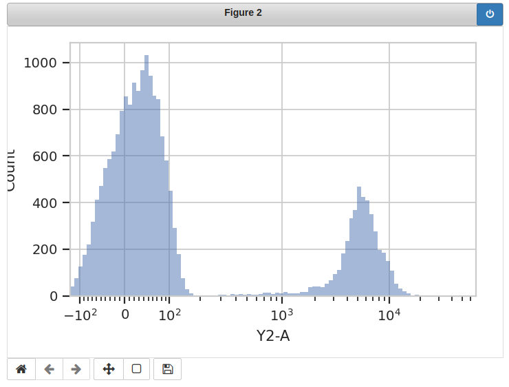

.. _dev_faq:

**************************
Frequently Asked Questions
**************************

These are some questions that are commonly asked about Cytoflow's modules,
especially by new users.

**Cytoflow seems like it could be useful for analyzing data other than FCS files.  Can I do that?**

Maybe!  Quite a few portions of the package assume that the data is from a flow 
cytometer.  This is quite explicitly baked into the point-and-click GUI; less 
so with the Python modules.  If you want to give it a go (and are using the 
Python modules), have a look at the :class:`Experiment` class.  You'll have to 
build one of those manually -- instead of creating one with :class:`ImportOp` 
-- and you'll obviously need to avoid modules that explicitly expect other FCS 
files to parameterize them. But otherwise, once you've got a fully-formed 
Experiment, you should (probably) be fine to use (most of) the rest of the package(?) 
Let me know how you get on.

**How do I save the plots I've made with the Python modules?**

:mod:`cytoflow` uses the :mod:`matplotlib.pyplot` stateful interface for making
plots.  Thus, there are two ways to save the plots.  The first is to use the
:func:`matplotlib.pyplot.savefig` -- see the :mod:`matplotlib` documentation
for more details.  (This option gives you the greatest flexibility in format,
resolution, etc.)

If you are using the Jupyter notebook, the second is to replace the
``%matplotlib inline`` magic with ``%matplotlib notebook``.  Then,
when you make a plot, the plot remains interactive.  Here's an
example:

Click the "disk" icon to download a copy of the image.

