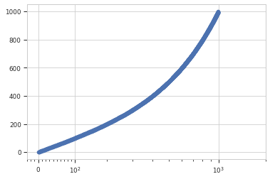

.. _dev_logicle

HOWTO: Use the `logicle` scale in other `matplotlib` plots
==========================================================

:mod:`cytoflow` implements an interesting scaling routine called
``logicle``.  It's a biexponential function that is "linear" near
zero and transitions smoothly to a logarithmic scale.  This
is particularly useful for flow cytometry data, which often
has data clustered around zero where a log-base-10 scale would
introduce aliasing.  (See the papers referenced below for
rationale and implementation details; :mod:`cytoflow` uses the C++
code from the second paper.)

I have been asked several times how to use a ``logicle`` scale
for other :mod:`matplotlib` plots.  This is difficult because,
unlike the ``log`` scale, ``logicle`` is *parameterized* -- the
precise location of the linear-to-log transition, how many decades
of negative data, etc. all need to be specified in order to
create a usable scaling function.

However, I recognize that there are occasions when you may want
to use a plot that is not baked into :mod:`cytoflow`.  Here's a
code fragment that should get you pointed in the right direction.
However, this is an *explicitly unsupported use-case* -- please 
don't file bug reports if you're having trouble with this::

   import matplotlib.pyplot as plt
   import cytoflow as flow
   
   x = range(1, 1000)
   y = range(1, 1000)
   
   tube1 = flow.Tube(file = 'data/RFP_Well_A3.fcs',
                     conditions = {'Dox' : 10.0})
   tube2 = flow.Tube(file='data/CFP_Well_A4.fcs',
                     conditions = {'Dox' : 1.0})
   
   import_op = flow.ImportOp(conditions = {'Dox' : 'float'},
                             tubes = [tube1, tube2])
   
   ex = import_op.apply()
   logicle = flow.utility.scale_factory('logicle', ex, channel = 'V2-A')
   
   # the channel = 'V2-A' parameter in the scale_factory() call tells
   # the logicle scale instance to use that channel to estimate its
   # parameters.  if you want to use a condition or statistic, say
   # condition = ..... or statistic = ..... instead.
   
   plt.scatter(x, y)
   ax = plt.gca()
   plt.gca().set_xscale('logicle', 
                        **logicle.get_mpl_params(ax.get_xaxis()))
   

References
----------

[1] A new "Logicle" display method avoids deceptive effects of logarithmic 
    scaling for low signals and compensated data.
    Parks DR, Roederer M, Moore WA.
    Cytometry A. 2006 Jun;69(6):541-51.
    PMID: 16604519
    http://onlinelibrary.wiley.com/doi/10.1002/cyto.a.20258/full
    
[2] Update for the logicle data scale including operational code 
    implementations.
    Moore WA, Parks DR.
    Cytometry A. 2012 Apr;81(4):273-7. 
    doi: 10.1002/cyto.a.22030 
    PMID: 22411901
    http://onlinelibrary.wiley.com/doi/10.1002/cyto.a.22030/full