.. _01_quickstart:

**********
Quickstart
**********

*Welcome to Cytoflow!*  This document will demonstrate importing
some data and running a very basic analysis using the GUI.  It
follows the same analysis as the `introductory Jupyter notebook`_
and should help you get started with the following steps:

.. _introductory Jupyter notebook: https://github.com/cytoflow/cytoflow/blob/master/docs/examples-basic/Basic%20Cytometry.ipynb

* Importing data
* Basic visualizations
* Gating
* Summary statistics

If you'd like to follow along, you can do so by downloading one of the
**cytoflow-#####-examples-basic.zip** files from the 
`Cytoflow releases page <https://github.com/cytoflow/cytoflow/releases>` 
on GitHub.

Importing data
==============

Start the software.  The left panel is the "workflow" panel, and
upon startup has a single operation named **Import Data**.  Click
*Set up experiment...*

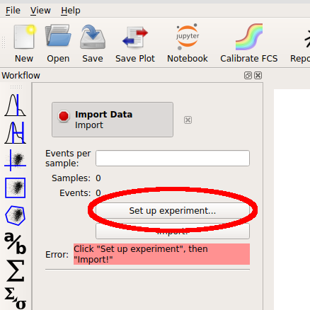

In the **Experiment Setup** dialog that appears, click *Add tubes...*

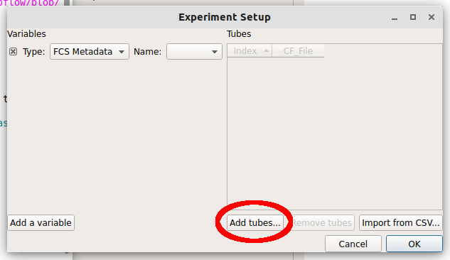

Choose *CFP_Well_A4.fcs* and *RFP_Well_A3.fcs*.  You can select multiple
files by holding down the *Control* key (Windows or Linux) or the *Command* 
key (Mac) while clicking on the files.

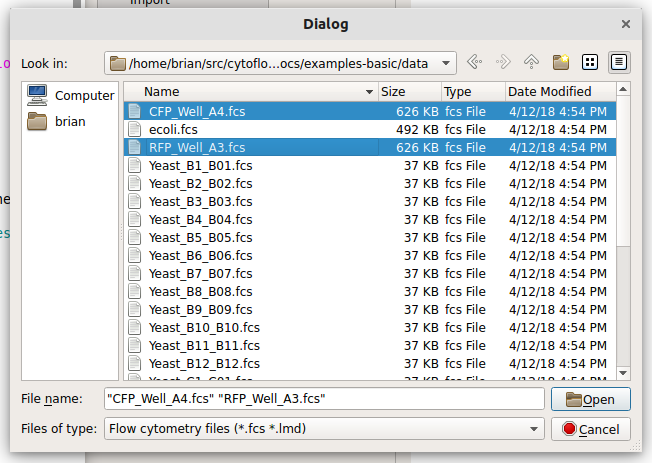

Each file is now a row in the *Tubes* table.  Cytoflow assumes that your 
FCS files were all collected under the same instrument settings (voltages,
etc) but have varying experimental conditions (ie your independent 
variables.)  We now have to tell Cytoflow what those conditions are for
each tube.  Click *Add a variable*

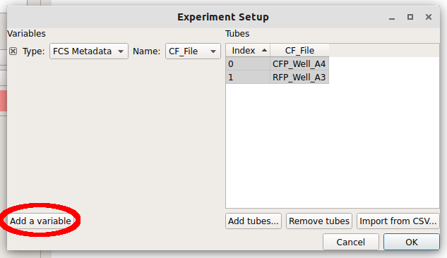

We can make a new variable that is a *Category*, a *Number* or 
*True/False* (ie a boolean.)  Since these two tubes were exposed to
different amounts of the small molecule *doxycycline*, pull down
the "Type" selector and choose *Number*.

.. image:: images/01_05_number.png

Type the name "Dox" into the *Name* box.  Notice how there's now a new
column named "Dox" in the *Tubes* table.

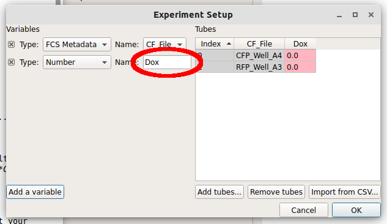

Note how the new column is red.  Each tube must have a *unique set of 
conditions* to import the data -- any tube that shares conditions with
another tube is labeled red like this.  Type "1.0" into the "Dox" column
for the first row (CFP_Well_A4) and "10.0" into the "Dox" column for
the second row (RFP_Well_A3).  Notice how all the cells are white.

.. image:: images/01_07_dox.png

Click "OK" to return to the main screen.

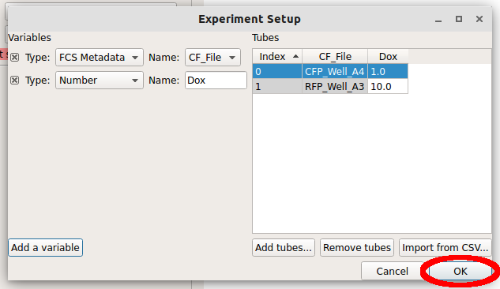

Now, all the channels in those files show up in the Import dialog.  You
can rename the channels if you'd like, or remove channels that you're
not using, but we won't worry about that here.  Click "Import!" to
import the data.  Note that the red stop-sign on the module header
changes to a green check-mark to show that the operation succeeded.

Basic plotting
==============

.. image:: images/01_09_import.png

Let's plot the data.  The right panel shows your view settings; choose
the Histogram plot button.

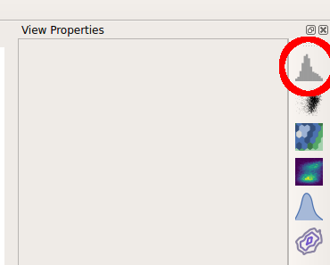

The controls in the right panel are the view parameters.  We won't get
a plot until we choose a channel to view.  Pull down the *Channel* 
selector and choose "Y2_A".  

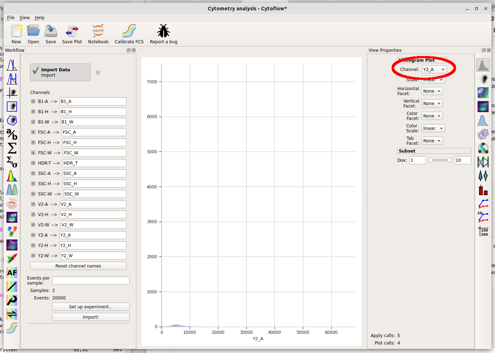

Cytoflow immediately displays a plot.  Unfortunately, most of the data
in this channel is clustered around 0, which makes it difficult to see
using a linear scale (the default.)  We can use a different scale
by selecting the "Scale" option -- choose "logicle" instead.

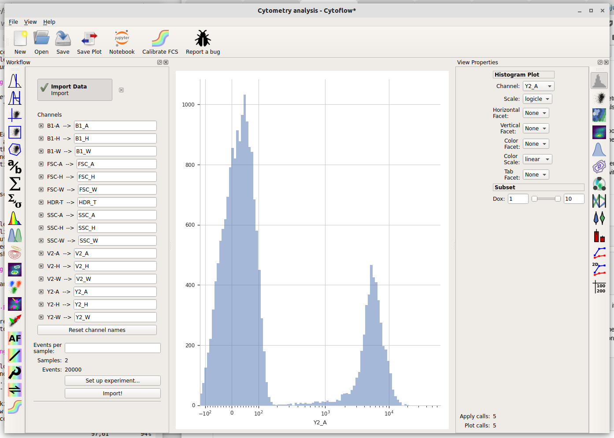

The *logicle* scale is interesting -- it's linear around 0 and logarithmic
elsewhere, and we can immediately see that this data is bimodal.

But wait -- which tube are we looking at?  Here we encounter one of
the central principles of Cytoflow: **by default, we're looking at
the entire data set.** This data comes from both tubes, not just one.
We can tell Cytoflow to make a separate plot for each Dox concentration
by changing the *Vertical facet* option to "Dox".

.. image:: images/01_13_vertical_facet.png

We can also plot the two different Dox concentrations on the same plot
using different colors by setting *Color Facet* to "Dox" instead.  Note
that **you must change Vertical Facet back to "None" as well.**

.. image:: images/01_14_color_facet.png

Basic gating
============

So there's a clear difference between the two tubes: one has a substantial
population above ~200 in the Y2-A channel and the other doesn't.  What
is the proportion of "high" cell in each tube?  To count these two
populations, we first have to gate them out.  Let's use a threshold gate.
First, make one by choosing the threshold gate on the operations toolbar:

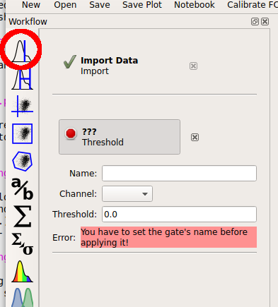

Then, set the operation's name to "T" and the channel to "Y2-A".  Note
that when you set the channel, a plot appears in the central pane.
It's on a linear scale again -- change it to "logicle" on the plot
options pane.

.. image:: images/01_16_threshold_params.png

Note that when you move your mouse across the center pane, you now get 
a blue cursor that follows it.  You can set the threshold by clicking
on the pane.  Choose a value about 200 (ie, one tic above the 10^2
major label.)

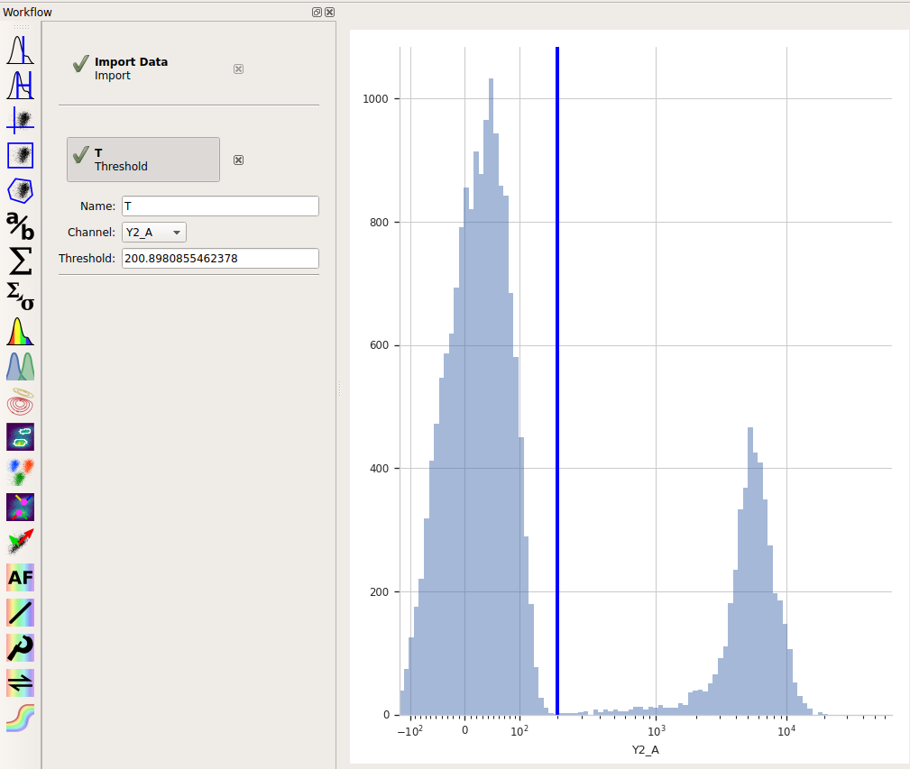

When you created a new Threshold gate, *you added a new condition to
the data set.*  This condition is *exactly like the "Dox" condition you
set up when you imported your data.*  That is, now there are some events
that are (Dox = 1 and T = True), some events that are 
(Dox = 1 and T = False), some events that are (Dox = 10 and T = True), 
and some events that are (Dox = 10 and T = False).

You can get a good feel for this if you make a new Histogram.  Set
the histogram parameters as follows:

* Channel = "Y2_A"
* Scale = "logicle"
* Vertical Facet = "Dox"
* Color Facet = "T"

.. image:: images/01_18_threshold_histogram.png

What are we looking at?  The two plots, top and bottom, represent the
different Dox amounts (look at the titles!)  Each is showing the
"high" and "low" populations we identified with the Threshold gate in
different colors.  Play around with the different facets until you
are comfortable with what does what.  Also poke at the "subset" controls.
(Don't worry, you won't break anything!)

Basic statistics
================

Cytoflow's reason for existing is to let you do quantitative flow
cytometry.  So lets quanitate those populations -- how many events are
in each of them?  Once you've identified populations, Cytoflow lets 
you compute a number of *summary statistics* about each population,
then graph statistics.  To create a new statistic, choose the large 
"sigma" button on the operations toolbar, which creates a new
Channel Statistic operation.

.. image:: images/01_19_sigma.png

Set the name of the new statistic to "Count".  Choose the "Y2_A" channel,
and set the "Function" to "Count".  Under "Group by", check *both* the
"Dox" and "T" tic boxes.

.. image:: images/01_20_stats_setup.png

The "Group by" settings are particularly important.  You're telling Cytoflow
*which groups you want to compute the function on.*  Cytoflow will
break your data set up into unique combinations of all of these variables
(which could be experimental conditions, like "Dox", or gates, like "T",
or other subsets from other operations) and compute the function for each
unique subset.  So, what we've asked Cytoflow to do is break the data
into four subsets:

* Dox = 1 and T = True
* Dox = 1 and T = False
* Dox = 10 and T = True
* Dox = 10 and T = False

and then compute the "Count" function on each subset.

Finally, let's plot that summary statistic.  Choose the bar plot from 
the Views toolbar:

.. image:: images/01_21_bar.png

Set the view parameters as follows:

* Statistic = ('Count', 'Count')

  Note: the new statistic is called ('Count', 'Count') because the
  channel statistic operaton's *name* was "Count" and the *function*
  you applied was also named "Count".

* Variable = "Dox"
* Hue Facet = "T"

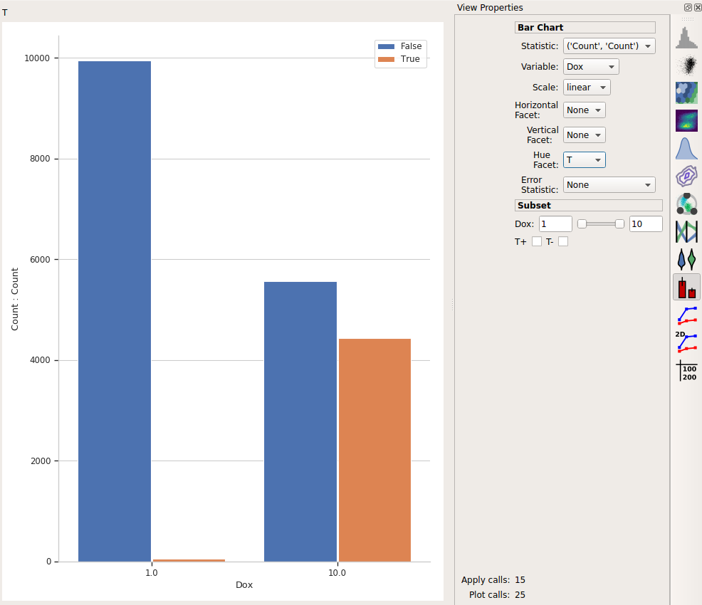

This is the bar plot we wanted: comparing different Dox levels (the
two bars on the left vs. the two bars on the right) and how many
events were below the threshold (T = False, in blue) vs how many
were above it (T = True, in orange.)

Export the plot
===============

I like to think that Cytoflow's graphics are nice-looking.  Possibly
nice enough to publish!  (Also, if you publish using Cytoflow, please
cite it!)  To export the plot, choose "Save plot..." from the toolbar
at the top.

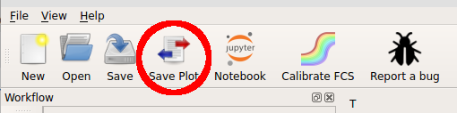

In this dialog, you can set many of the visual parameters for the plot, 
such as the axis labels and plot title.  You can also export the figure
with a given size (in inches) and resolution (in dots-per-inch) by clicking
"Export figure....".

.. image:: images/01_24_save_plot_dialog.png

To return to Cytoflow, click "Return to Cytoflow".

