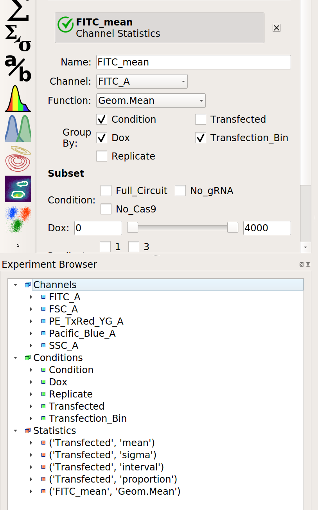
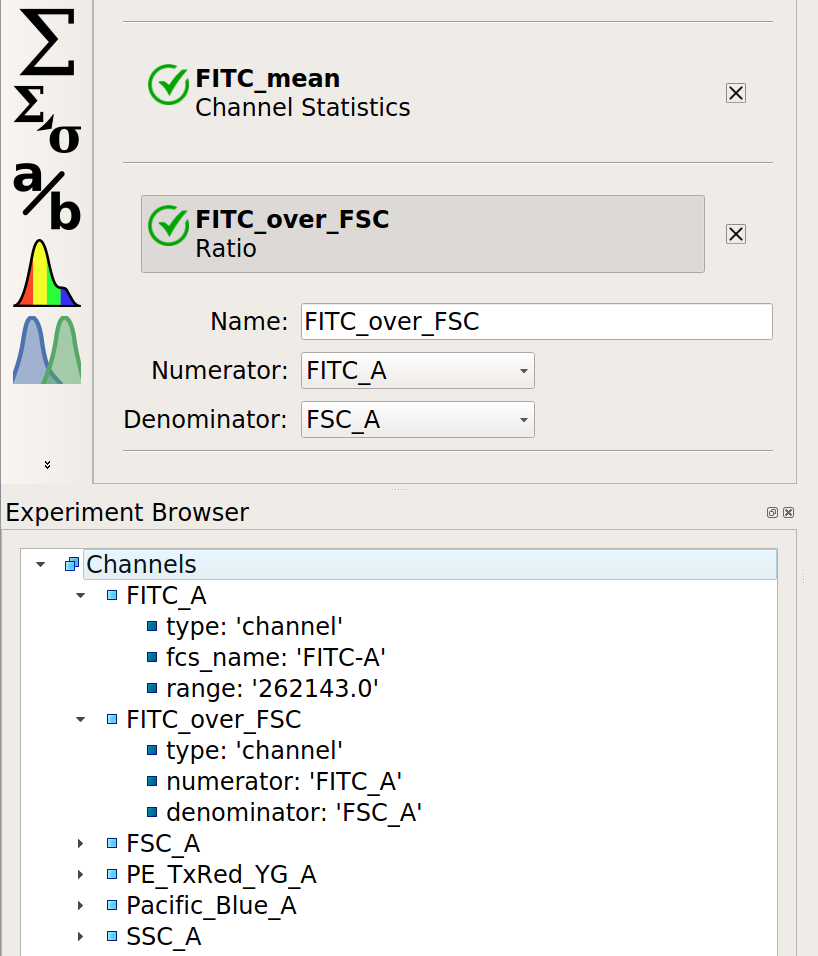
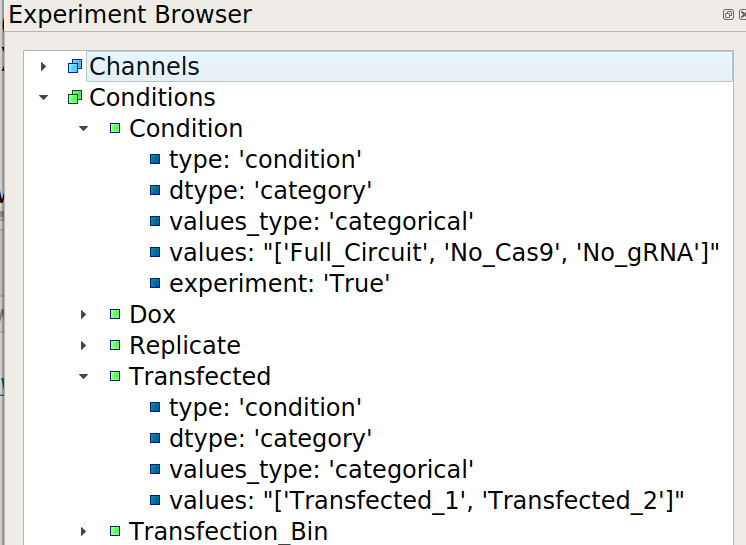
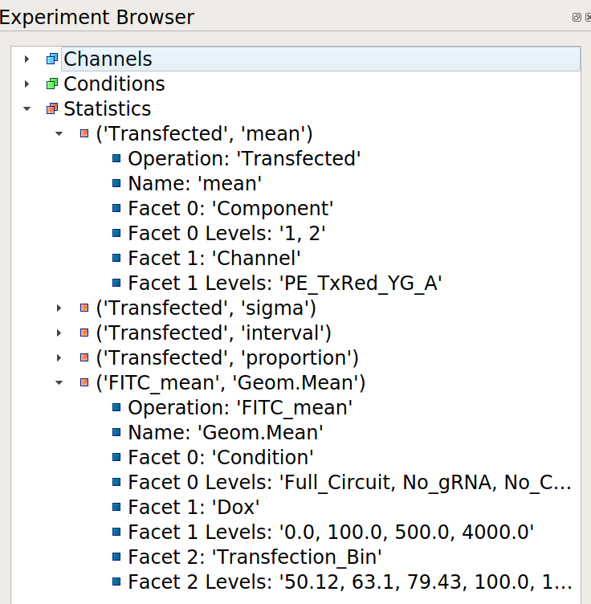

.. _user_browser:

Guide: How can I understand the experiment structure?
=====================================================

When creating a complex analysis, it can be easy to lose track of the 
channels, conditions, and statistics that you've created in your workflow.
In order to give users both a quick overview of their experiment and allow
them to "drill down" into their experiment structure, Cytoflow includes an
**Experiment Browser**.

Consider the experiment outlined in :ref:`user_kiani` -- five channels,
three experimental conditions, two conditions added in the analysis,
and a number of statistics. It's a lot to keep in your head! However, if you
select the last operation in the workflow, the **Experiment Browser** shows
this:

.. note:: If the **Experiment Browser** isn't visible, you can show it by 
   selecting it from the **View** menu or clicking the corresponding 
   button on the button bar.
   
Here, you can see the channels, conditions, and statistics in the experiment
in a tree view. If you open one, by clicking the caret or double-clicking
the name, you are shown additional information about each.  Let's walk through
all three below.
   
Channels
--------

Each *channel* is shown in the experiment browser.  When you open a channel,
additional metadata about the channel is visible, such as the original name
in the ``.fcs`` file and the range of the channel.  Additionally, if the channel
has been manipulated in any way, or is a "synthetic" or derived channel, the 
operations that did so leave some metadata as well.  For example, if you
create a new channel with the **Ratio** operation, the numerator and 
demoninator are show.

Conditions
----------

Remember, *conditions* -- either experimental conditions or conditions
that were added by operations -- are how you control the plotting and
statistics.  You can view the conditions in the browser as well.
When you open them, you can see the type of condition, the condition's
type (boolean, numeric, categorical), and the values of that condition.

Statistics
----------

Remember, *statistics* are summaries of the data that are computed by
an operation.  The statistics that have been added to the experiment
are also shown by the browser window, including the facets over which
the statistic was computed and the various values of those facets.

