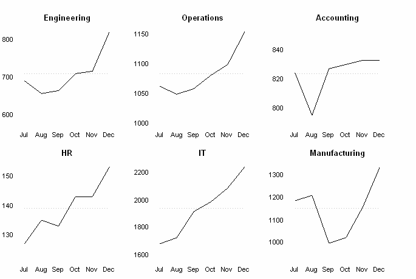

.. _user_facets:

Facets
======

``Cytoflow`` uses an idea called *facets* to help you analyze data. It's taken from
Tufte's `trellis plots <https://en.wikipedia.org/wiki/Small_multiple>`_, which
is a fancy term for a simple idea: that to *compare* two data sets, you should
plot them next to eachother using the same scale and axes:

   
   This figure shows multiple line plots on the same X axes, making 
   it easy to compare between them. (Image by Wikipedia user `Chrispounds`)
   
Let's say I have two different FCS files. As I imported them, I created a ``Sample``
variable and assigned the tubes ``Sample_1`` and ``Sample_2``, respectively. Now I 
want to compare them using a histogram plot. Remember that by default, ``Cytoflow``
shows *all* of the data, *from both of the tubes*, at the same time on the plot:

However, ``Cytoflow`` also makes it easy to compare these two samples. I can put 
them on separate plots, side-by-side, by setting ``Horizontal Facet`` to the 
*variable* that I want to compare. In this case, it's ``Sample``:

Note that the title of the plot shows me both which *variable* I'm comparing and
what the *value* of that variable is in each plot.  Similarly, I can create
separate plots but stack them on top of eachother with the ``Vertical Facet``
setting:

You can also view them on the same plot but with different colors using
the ``Color Facet`` setting:

(No, you can't change the colors, at least not in the point-and-click interface -- 
they're the from default 
`Seaborn qualitative palette <https://seaborn.pydata.org/tutorial/color_palettes.html#qualitative-color-palettes>`_. 
If you'd like to be able to change the colors, submit a bug request or (even better) a patch!)

Finally, if you have multiple variables, you can set multiple facets at once to
compare across them all. For example, I've added a ``Threshold`` gate called
``Morpho``, and now I can compare data across different values of both ``Sample``
and ``Morpho``:

