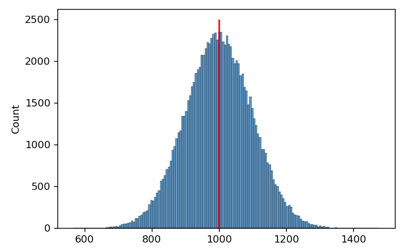
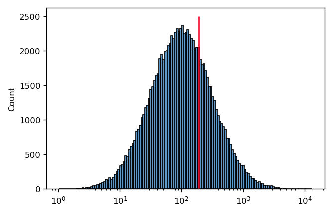
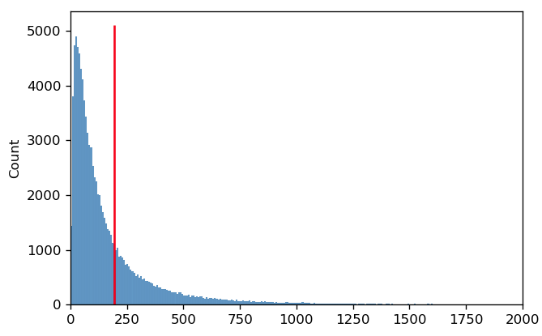
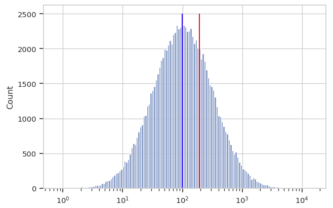

.. _user_mean:

Guide: Which measure of center should I use?
============================================

When analyzing flow cytometry data, we often want to know the *center* of a 
distribution.  For example, we may be treating our cells with a drug and 
want to be able to report that "fluorescence decreased XXX fold."

Often, we use the *arithmetic mean* to find the center.  For example, 
in the histogram below, I've drawn 100,000 samples from a normal distribution
with a mean of 1000 and a standard deviation of 100.  The arithmetic mean
is 999.40; I've drawn a red line on the plot at this position.

It's pretty clear that this is a good measure of this distribution's
center.  However, in cytometry, we often encounter distributions that
are symmetrical *on a log scale.*  This is the case below -- and again,
I've drawn a red line at the arithmetic mean of this distribution.

In this case, it's pretty clear that the arithmetic mean is *not*
a good measure of this distribution's "center".  It's easy to see
why this is happening if we plot the *same* data on a *linear*
scale instead:

The reason that the *arithmetic* mean isn't a good measure of center
is because on a linear scale, *the distribution is not symmetric.* 
Instead, the mean is being "dragged" up by the larger values in the
"tail" of the distribution.

A better measure of center for this kind of distribution is the 
*geometric mean.*  Let's say we have n values.  Instead of adding
the values together and dividing by n (arithmetic mean), to find
the geometric mean we multiply all the numbers together and then
take the nth root.  Below, you can see the log-scaled data again,
with the arithmetic mean in red and the geometric mean in blue.
It's clear that for data of this sort, the geometric mean is
a better measure of "center".

``Cytoflow`` implements both a geometric mean (to measure center) 
and a geometric "standard deviation" to measure spread.  I highly
recommend you use these instead of their arithmetic brethren when analyzing
data that appears normal (or at least symmetric) on a logarithmic
scale.

PS - why is so much biology log-normal?  My colleague Jacob Beal has done some
theoretical work on the topic.  You can read his paper here:

Biochemical complexity drives log-normal variation in genetic expression. 
Jacob Beal, Engineering Biology, 1.1 (2017), pp. 55-60, July 2017.
https://digital-library.theiet.org/content/journals/10.1049/enb.2017.0004
