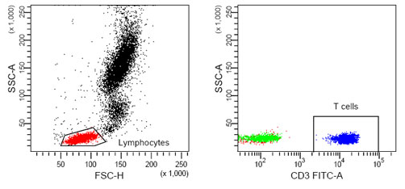
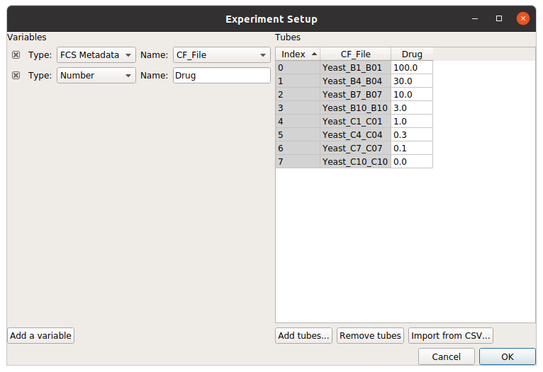
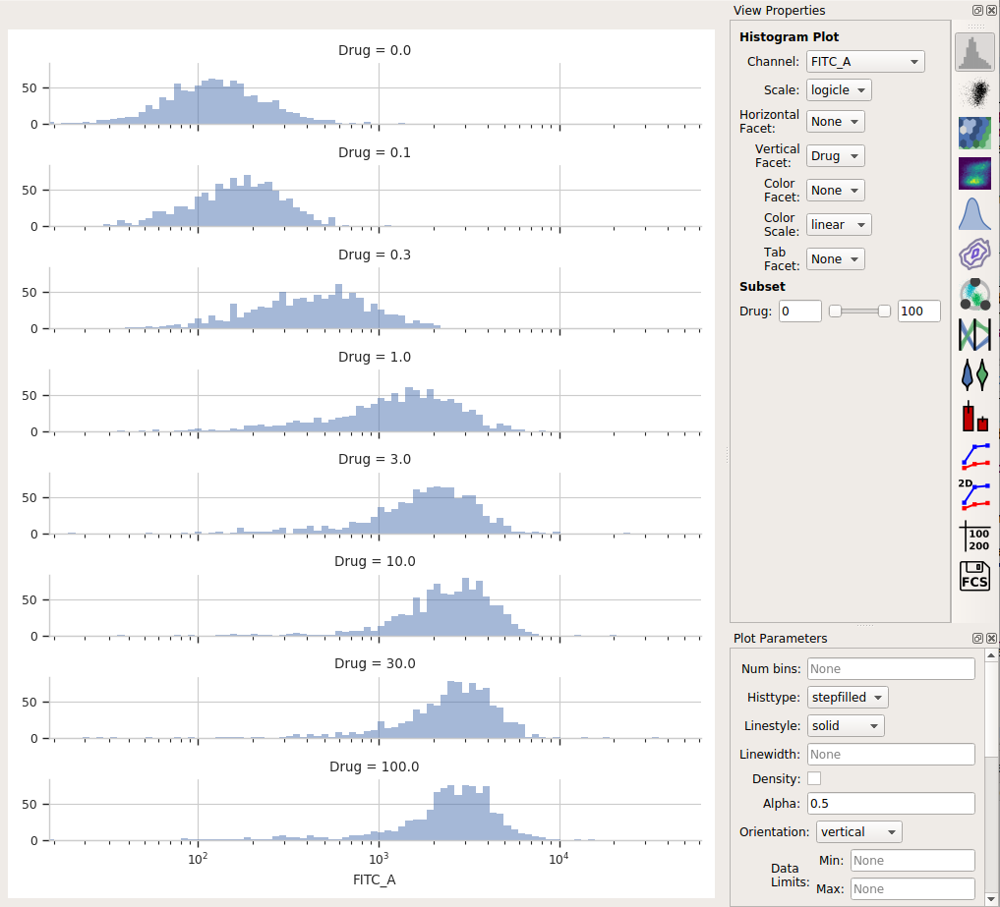

.. _user_statistics:

Using statistics to summarize data
==================================
 
Summarizing data is a key step in flow cytometry. Even simple, "traditional"
analyses involve drawing gates and counting the number of events in them.

   
   What proportion of these events were T-cells?
   
``Cytoflow`` calls these summary values -- such as the mean or count of a 
set of events -- *statistics.*  Here, I'm using the word "statistic" in
the technical sense, as in "a quantity that is computed from a sample."

Another key insight is that we are usually interested in 
*how a statistic changes* across our experiment. For example, let's
say that I have some cells that express GFP, and I want to know how the
amount of GFP expression changes as I alter the amount of a small molecule
that I treat my cells with. I can create a *statistic*, then plot that
statistic, to answer my question. Let's see how I might do so:

First, I need to import my data. In my experiment setup (in the **Import Data**
operation), I must specify the *conditions* for each tube -- that is, how 
the cells in each tube are different. In this case, I treated each tube with
a different concentration of my drug, so I use "Drug" as a condition.

Using a histogram (and a vertical :ref:`facet <_user_facets>`), I can see that the
GFP intensity (as displayed in the FITC-A channel) is in fact changing when I
vary the amount of drug I treat the cells with.

