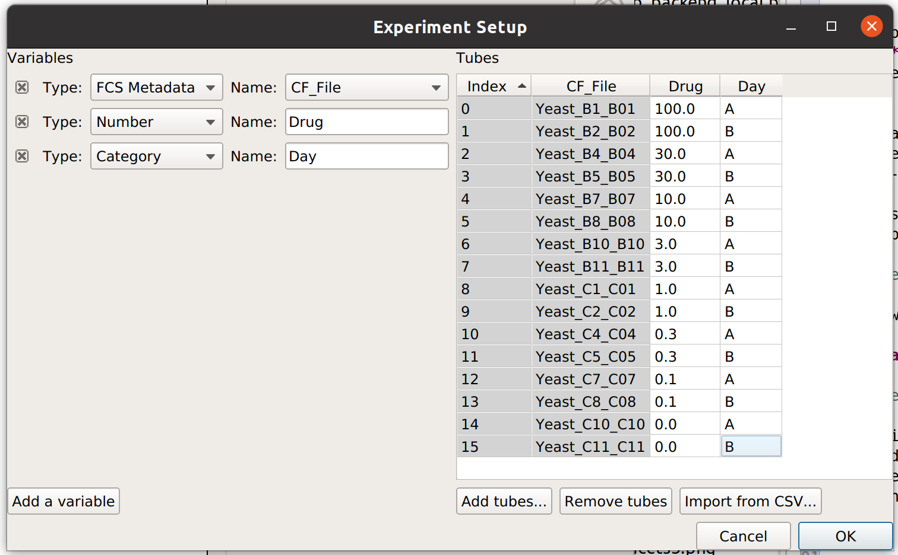

.. _user_statistics:

Guide: Using statistics to summarize data
=========================================
 
Summarizing data is a key step in flow cytometry. Even simple, "traditional"
analyses involve drawing gates and counting the number of events in them.

   
   What proportion of these events were T-cells?
   
``Cytoflow`` calls these summary values -- such as the mean or count of a 
set of events -- *statistics.*  Here, I'm using the word "statistic" in
the technical sense, as in "a quantity that is computed from a sample."

Another key insight is that we are usually interested in 
*how a statistic changes* across our experiment. For example, let's
say that I have some cells that express GFP, and I want to know how the
amount of GFP expression changes as I alter the amount of a small molecule
that I treat my cells with. I can create a *statistic*, then plot that
statistic, to answer my question. Let's see how I might do so.
(I'm using data from the *examples-basic* directory -- feel free to follow
along.)

First, I need to import my data. In my experiment setup (in the **Import Data**
operation), I must specify the *conditions* for each tube -- that is, how 
the cells in each tube are different. In this case, I treated each tube with
a different concentration of my drug, so I use "Drug" as a condition.

.. image:: images/stats1.png

Using a histogram (and a vertical :ref:`facet <user_facets>`), I can see that the
GFP intensity (as displayed in the FITC-A channel) is in fact changing when I
vary the amount of drug I treat the cells with.

.. image:: images/stats2.png

Each distribution seems pretty symmetrical when plotted on a logarithmic scale, so
let's use a *geometric mean* to summarize them. I can do that with a **Channel Statistics**
operation (the one whose button is a big sigma.)

Note that I've set a name for the statistic, the channel I want to summarize,
and the function I want to apply.  Probably the most important -- and most
confusing! -- parameter is **Group By**. This specifies how I want to ``Cytoflow``
to group the data before applying **Function** to channel -- in this case,
I've set it to *Drug*.  Here's the order that things happen in:

#. Cytoflow sees how many different values of the *Drug* parameter are in the
   data set.
  
#. It separates the data into groups -- subsets -- by those different values of
   *Drug*. If each tube has a different *Drug* value, then each of those subsets
   is the events from a single tube. However, *if I had multiple tubes with the*
   *same **Drug** value, those tubes would be combined.*
  
#. For each subset of the data -- each unique value of *Drug* -- ``Cytoflow``
   applies the function I asked for (in this case, *Geom.Mean* -- the geometric
   mean -- to the channel I said -- in this case, *FITC_A*.
  
This results in a table of those summary numbers for each subset.  You can view
this table directly (with the **Table View**, natch) -- here's what we see.

The **Feature** property is which column of the statistic you'd like to view or
plot -- it is often the same as the channel name, but not always.

If you would like to export this data, you can of course do so with the **Export**
button. However, ``Cytoflow`` can plot it directly as well, with the 
**1D Statistics View**.

.. image:: images/stats5.png

In setting up this plot, I selected the statistic to plot and the variable
I wanted on the X axis.  I also changed the statistic scale (to *log*) and the
variable scale (to *logicle*), which makes things easier to interpret. 
(Note that if I had left the variable scale on *log*, it would not have
plotted the "Drug = 0" condition, because log(0) is undefined!

------------

It's clear from this analysis that the mean GFP value increases as the amount
of drug increases.  However, statistics are more powerful than this because
they can capture multiple variables at the same time.  For example, let's
imagine that I did two different replicates on two different days:

In this case, I have imported twice as many tubes, and labeled them with *both*
the amount of drug I used *and* which day I did the experiment on.

Now, when I set up my **Channel Statistic**, I'll set **Group By** to 
*both Day and Drug.* 

Let's see what this does to my table:

Note that I now have *two* conditions that I can use when making my
table: **Drug** and **Day**.  This is because the channel statistic
operation computed a geometric mean for *each unique combination of*
*Drug and Day values.*  So instead of 8 means, now I have 16.  Here,
I've configured the table view to show different amounts of drug
on different rows and different days in different columns.

Again, I could export this if I wanted -- or I could plot it.  Let's
make another **1D Statistics View** plot, putting the two different
days in different colors:

Note that the "Day A" values are pretty consistently higher than 
"Day B".  I wonder how much higher, and how consistently so?  We
can answer this question with another operation, called
**Transform Statistic**.  This works similarly to **Channel Statistic**,
in that it groups things together and applies a function.  However,
instead of grouping together events from the flow cytometer, it
groups together *values in another statistic* before applying the
function.  (This way, it *transforms* that statistic -- see?)

This time, I'll group by **Drug** (and *not* **Day**).  Remember, this will
take the starting statistic, split it into groups for each unique value
of **Drug**, and then apply the **Fold** function to each group.  (Fold
simply divides every value in the group by the minimum value.)

.. image:: images/stats10.png

.. image:: images/stats11.png

The **Fold** function produces a statistic the same size and shape as
the one it's operating on.  However, some functions *reduce* the size
of the statistic -- for example, if we apply **Geom.Mean** again, 
we only get a table with one column (because it's taking the geometric
mean of all the values in each group):

.. image:: images/stats12.png

Statistics are a pretty key part of the way ``Cytoflow`` is meant to be
used.  I hope this explanation made sense -- if you feel it can be 
improved, please feel free to submit a bug (or, even better, a patch
or pull request) to improve it.
