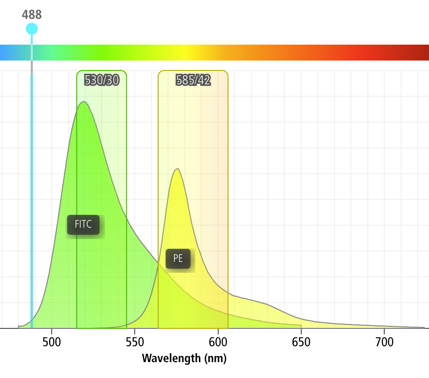

.. _user_bleedthrough:

HOWTO: Compensate for bleedthrough
==================================

One common issue in flow cytometry is the fact that spectrally adjacent
channels often overlap.  For example, if I'm trying to measure a green
fluorophore like FITC, and a yellow fluorophore like PE, a significant 
amount of FITC fluorescence will also be picked up by my PE channel, as
demonstrated by the screenshot below 
(from the `BD Spectrum Viewer <https://www.bdbiosciences.com/en-us/resources/bd-spectrum-viewer>`_)

As you can see, something like 12% of the FITC fluorescence ends up in
the PE channel!

Fortunately, a little linear algebra can fix this problem, and ``Cytoflow``
makes it easy.  However, you'll need to run a few controls:

* A *blank* control -- one with your cells but without any fluorophores.
  This will let us measure the "background" fluorescence (or autofluorescence)
  of the samples.

* A set of *single-color* controls -- for each fluorophore, one control
  that is stained with (or expresses) only that fluorophore and no others.
  These let us measure how much signal "bleeds through" into the non-target
  channels.  These controls should be as bright as (but no brigher than)
  your brightest experimental sample.
  
.. warning::
    These controls must be collected using the SAME instrument settings as
    your experimental samples.  It's really best if they're collected at the
    SAME TIME as your experimental samples -- even properly calibrated instruments 
    are known to drift substantially between days, or even over the course of
    a single day.  And yes, that means you *really should* run these controls for 
    *every* experiment.  If you'd like a way to correct for day-to-day variability,
    see :ref:`user_beads`.
  
  
Procedure
---------

#. Collect the controls listed above. 

#. Import your data into ``Cytoflow``.  Do *not* import your control samples 
   (unless they're part of the experiment.)  In the example below, we'll have
   three fluorescence channels -- *Pacific Blue-A*, *FITC-A* and *PE-Tx-Red-YG-A* 
   -- in addition to the forward and side-scatter channels.
   
   .. image:: images/bleedthrough2.png
   
#. (Optional but recommended) - use a gate to filter out the "real" cells from
   debris and clumps.  Here, I'm using a polygon gate on the foward-scatter and 
   side-scatter channels to select the population of "real" cells.  (I've named
   the population "Cells" -- that's how we'll refer to it subsequently.
   
   .. image:: images/bleedthrough3.png
   
#. Add the **Autofluorescence** operation (it's the |AF| button).  Specify the file
   containing the data from the blank control, choose the channels you want to 
   apply the correction to, and (if you followed the optional step above) choose the
   subset that you want to use to estimate the correction from.  Once you're done,
   click **Estimate!**
   
   The diagnostic plot shows a histogram of the fluorescence values from the blank
   file, and the red line indicates their median. This is the amount of "autofluorescence"
   that will be subtracted from your experimental data.
   
   .. image:: images/bleedthrough5.png
   
   .. note:: By choosing the "Cells" subset, I told ``Cytoflow`` to apply the *same gate*
             from that operation *to the blank data* before estimating the autofluorescence
             correction.  This way, the clumps and debris in the sample don't influence
             that estimate.  We'll do the same thing in the next step, when we apply the
             bleedthrough compensation.
             
#. Add the **Bleedthrough** operation (it's the |BL| button). For each control you have,
   click **Add Control**.  In the **Controls** list, choose the channel you're correcting
   and the file that contains the control data.  Again, if you followed the optional step,
   also choose the subset you want to estimate the correction from.  Then, click **Estimate!**.
   
   Here, the diagnostic plots show the data in the control files and the estimate that was fit
   to them.  Because it's a *linear* estimate, but the data is plotted on a *logarithmic* scale,
   the estimate lines are shown as curves.
   
   .. image:: images/bleedthrough7.png   

*And that's it.*  Now you can continue on with your analysis, secure in the knowledge that
you've successfully separated the adjacent fluorescence channels.

If you'd like to learn more, `Abcam has a good page <https://www.abcam.com/protocols/fluorescence-compensation-in-flow-cytometry>`_
about compensation, and Mario Roederer has an `even more detailed treatment <http://www.drmr.com/compensation/>`_.

.. |BL| image:: images/bleedthrough6.png
   

