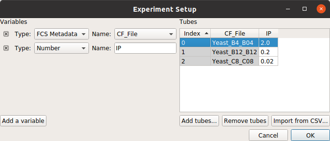
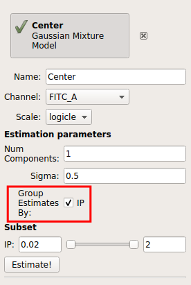
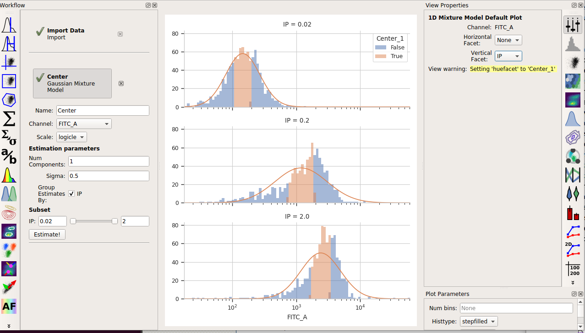
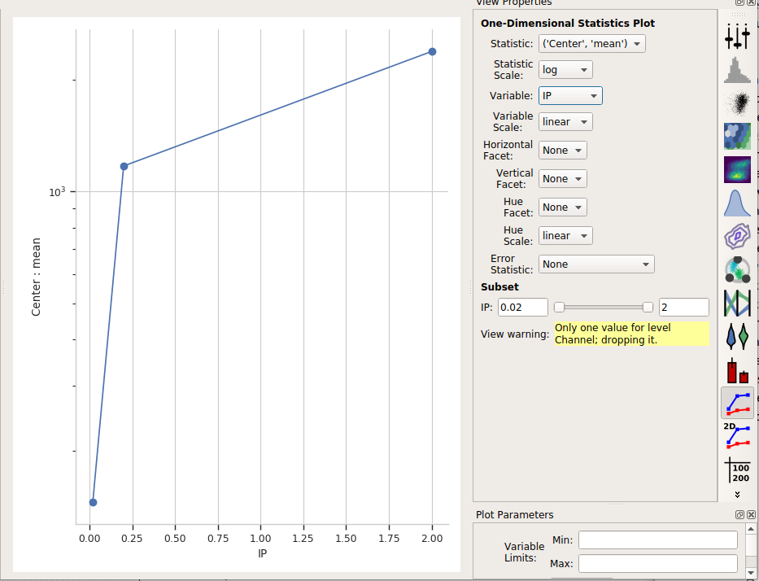

.. _user_by:

HOWTO: Use different gates for different subsets of data
========================================================

Sometimes, it makes sense to apply different gates to differen subsets of your
data set.  It's particularly useful when we're estimating the gate parameters
from the data.  For example, consider the following data (taken from the
**Yeast Dosage-Response Curve** tutorial.)  

.. image:: images/by2.png

Imagine that we want to use the :ref:`1D Gaussian operation <user_op_gaussian_1d>` 
to choose the events from the center +/- 0.5 standard deviation this data.  It's
clear that a gaussian model that fits the first data set won't fit the second 
or third!

To address this problem, most data-driven gates have a **Group estimates by** option.
Set this to a condition, and the operation will subdivide the data by that condition
and estimate *separate model parameters for each subset.*  For example, if we choose
**IP** as the group-by condition:

Then the operation will give us three different estimates, one for each value of **IP**:

And of course, don't forget that the operation also makes a new **statistic** 
containing the means:

