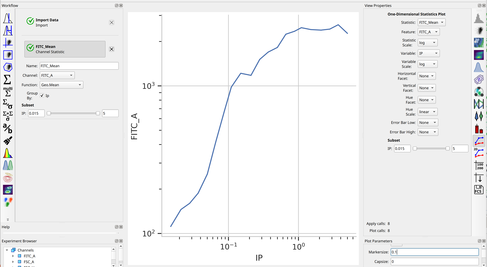
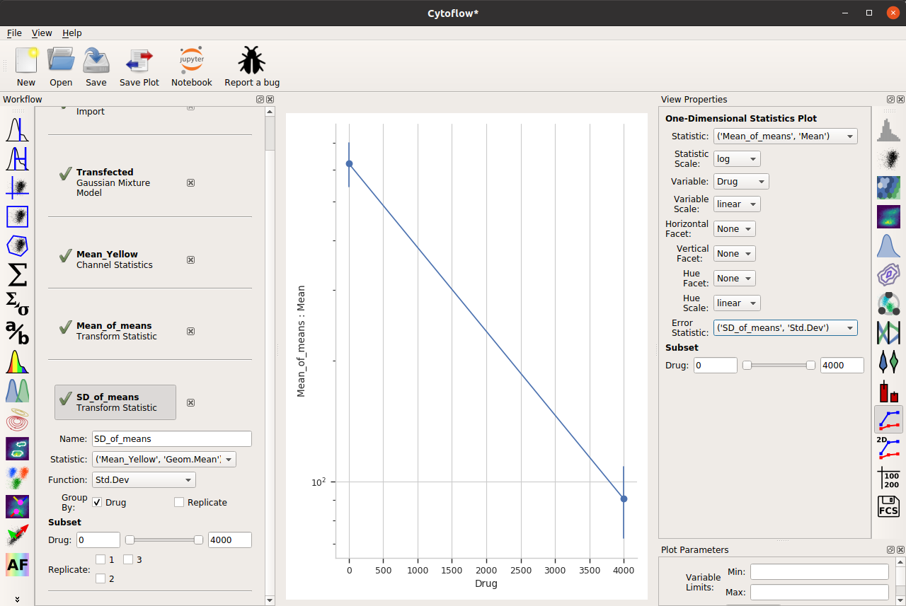
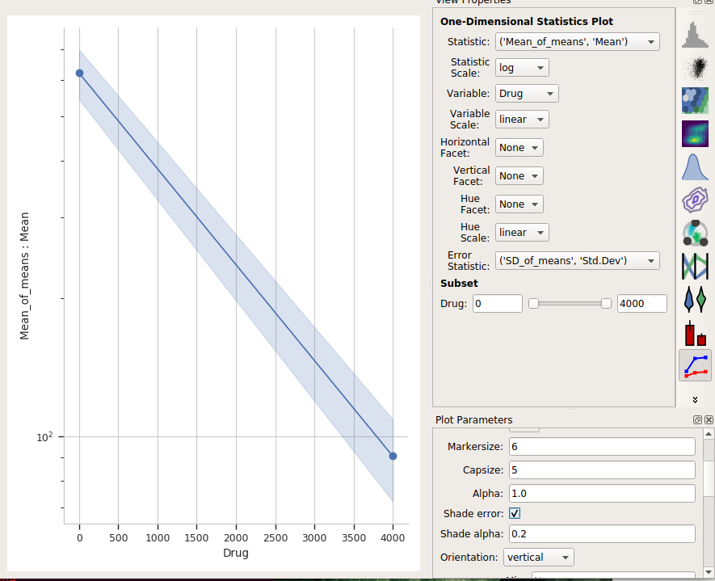

.. _user_error_bars:

HOWTO: Add error bars to a statistics plot
==========================================

While statistics plots of things like the :ref:`geometric mean <user_mean>` are
useful, we often want to add some sort of "error bars" to that plot as well.

For example, consider the following experiment (taken from the :ref:`dose response example <user_dose_response>`),
in which the geometric mean increases over time:

A few of the channel statistic functions, however, add *multiple features* -- for example, the
arithmetic mean plus-and-minus the standard deviation, or the geometric mean times-and-divided-by
the geometric standard deviation. If we choose one of these functions, we can set the 
**Error Bar Low** and **Error Bar High** view properties to the appropriate features, and
then we get error bars:

Two important things to note about this capability.  First, the error bar plotting facilities
are deliberately limited in the GUI -- there is more power in a Jupyter notebook, or you can
export your summary statistics and make pretty plots using other software.

And second, *error bars are a subtle topic and biologists often misuse them.* See

`Know when your numbers are significant <https://www.nature.com/articles/492180a>`_
 
and
 
`Error bars in experimental biology <https://rupress.org/jcb/article/177/1/7/34602/Error-bars-in-experimental-biology>`_

for a deeper discussion.

One last thing -- the "default" visual properties of those error bars are just
vertical lines.  This is useful if you've got a lot to visualize, but less so
if it's just a few points.  Many people like "end caps" on their error bars --
to get those, change the **Capsize** option in the **Plot Parameters** pane
to something greater than 0.

.. image:: images/error_bars6.png

Alternately, choose **Shade error** to get a "shaded" error display.  This one 
is particularly nice if you have lots of error bars.

