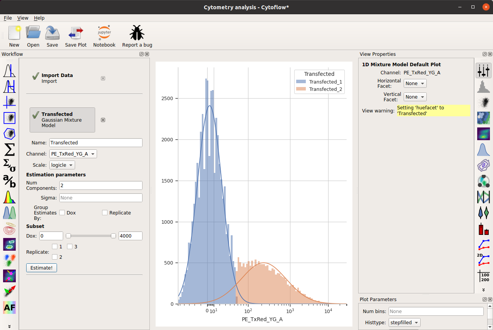
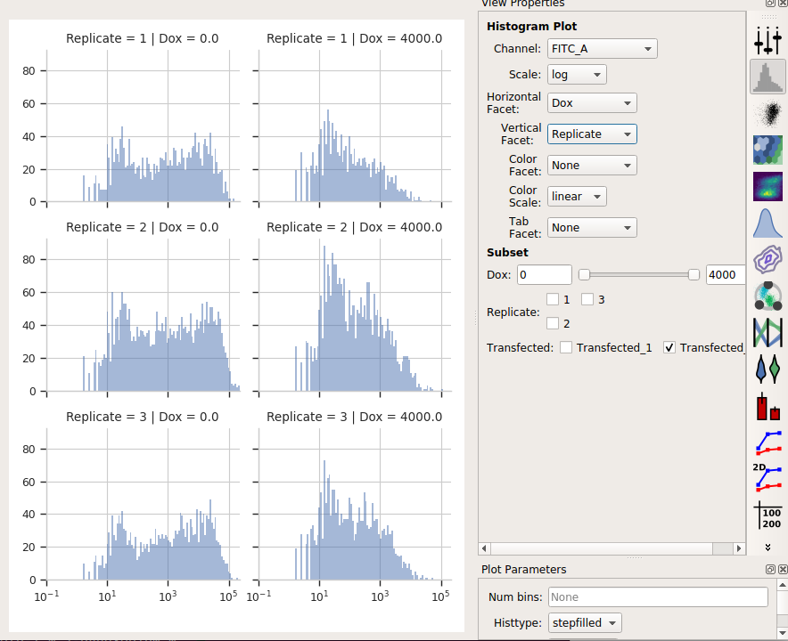
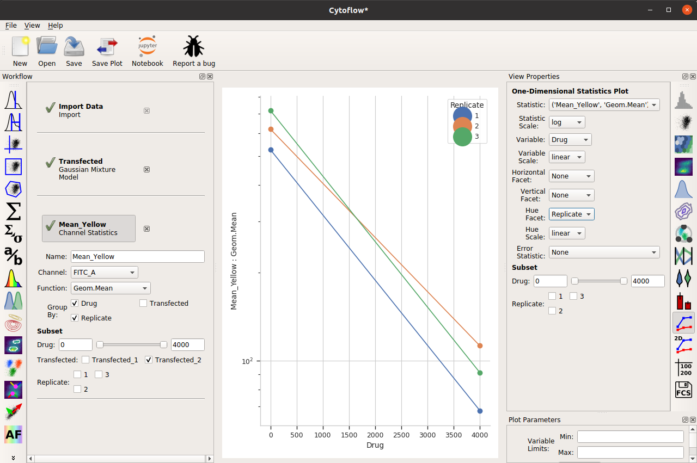
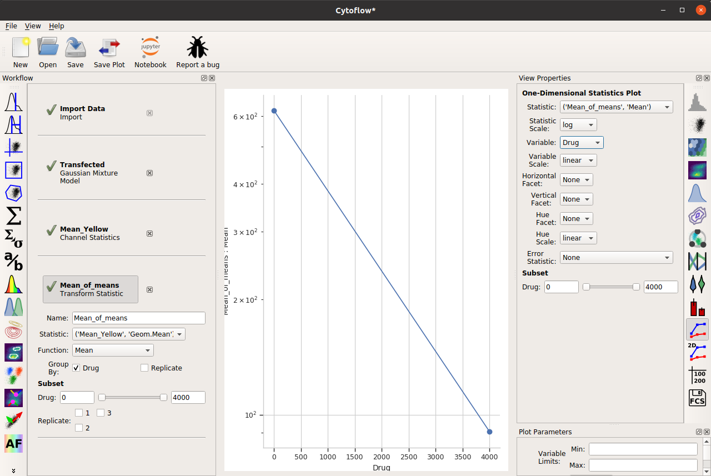

.. _user_error_bars:

HOWTO: Add error bars to a statistics plot
==========================================

While statistics plots of things like the :ref:`geometric mean <user_mean>` are
useful, we often want to add some sort of "error bars" to that plot as well.

For example, consider the following experiment (taken from the :ref:`Kiani et al example <user_kiani>`),
in which we have two treatment levels that we've measured in triplicate:

.. image:: images/error_bars1.png

Note that, as per the example, I'm only looking at cells that are already
fluorescing in the **PE_TxRed_YG** channel, which is my transfection marker.  

Let's look at how the **FITC_A** channel changes across my conditions and
replicates:

It's clear from the histograms that the **Drug == 0** populations have a much 
higher fluorescence in the **FITC_A** channel than the **Drug = 4000.0**
condition.  We can see that quantitatively by creating a **Geom.Mean** statistic:

When we compute the geometric mean of all six different subsets (two drugs
and three replicates), there's a definite decrease.  Our goal is to also
show a visual representation of the amount of variation between the three
replicates.

Before that, though, there's a subtle question to answer -- do we want to
take a "mean of means" -- that is, the geometric mean of these three means?
Or do we want a geometric mean of *all* of the underlying data?  I'm going to
choose the first approach, but I encourage you to think carefully about the
which is more appropriate in your own case.

So I'll add a **Transform Statistic** operation, to take the mean-of-geometric-means:

And now, to add error bars, I need *another* statistic.  This will also be a 
**Transform Statistic** operation, but this time to compute the standard 
deviation of the means:

.. image:: images/error_bars5.png

Two important things to note about the above image.  First, I have used the
same **Group by:** settings as the **Mean_of_means** operation.  And second,
when I set up my **One-dimensional statistics plot**, I chose the new 
statistic as the **Error statistic**.

One last thing -- the "default" visual properties of those error bars are just
vertical lines.  This is useful if you've got a lot to visualize, but less so
if it's just a few points.  Many people like "end caps" on their error bars --
to get those, change the **Capsize** option in the **Plot Parameters** pane
to something greater than 0.

.. image:: images/error_bars6.png

Alternately, choose **Shade error** to get a "shaded" error display.  This one 
is particularly nice if you have lots of error bars.

.. image:: images/error_bars7.png

One final thing -- the use of error bars is a subtle topic -- much more so than
most biologists grasp.  For a useful overview of the issues at play, please
see:

`Know when your numbers are significant <https://www.nature.com/articles/492180a>`_
 
and
 
`Error bars in experimental biology <https://rupress.org/jcb/article/177/1/7/34602/Error-bars-in-experimental-biology>`_

