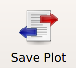

.. _user_export:

HOWTO: Export plots
===================

I'm really proud of the plots you can produce with ``Cytoflow``, and I hope
that you will find them nice enough to use in your talks, posters and
publications!  To help you do so, it's easy to export the current plot to
a variety of file formats.

Procedure
---------

#. Create the plot you want to save.  Here, I've got a set of histograms.

   .. image:: export1.png
   
#. Click the **Save Plot** button in the top toolbar: |EXPORT|

#. The **Save Plot** view will open.  In the center panel, you'll see the same
   plot -- but on the right, you'll see a pane with a bunch of visual style
   options you can adjust.  (The eagle-eyed among you will recognize this as
   the same panel that shows up below the view parameters pane in the main
   application.)
   
   .. image:: export3.png
   
#. Adjust the display options to your liking.  One particular one to pay
   attention to is the **Context** setting, which changes the relative size of
   the annotations (axes, labels, legend, etc) relative to the main plot.
   Here, I've changed it to *talk* and set the plot to a horizontal layout
   instead of a vertical one.
   
   .. image:: export4.png
   
#. Set the *width*, *height*, and *resolution* of the final image.  (Width
   and height are in inches, and resolution is in DPI -- dots per inch.)
   
   .. image:: export5.png
   
#. Click **Export figure...** to open your system's usual **Save As**
   dialog box.  Pay *particular attention* to the file *type* -- it's
   here where you can choose to save as, say, a PNG or a PDF or a TIFF.
   Which formats are available to you are system-dependent, but if you
   need a raster image (to put in a talk, for example), I suggest PNG,
   while if you need a vector image (to submit with a manuscript, for
   example), I suggest PDF or EPS.
   
#. Once you're done, click **Return to Cytoflow** to return to the main
   application.

