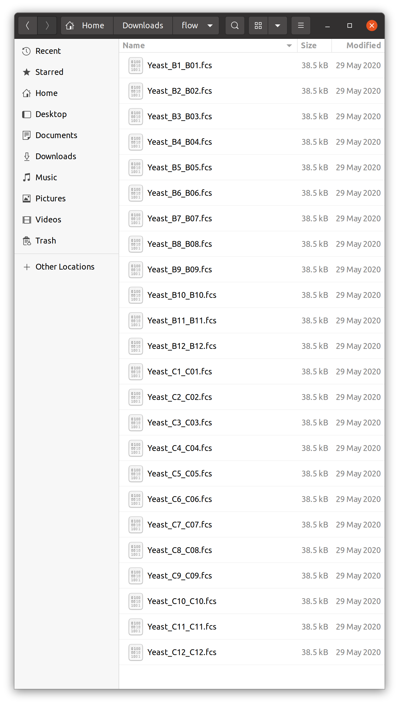
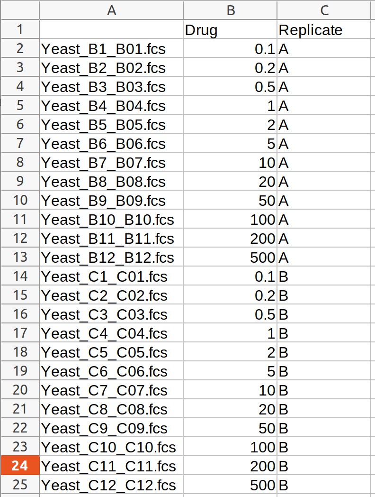
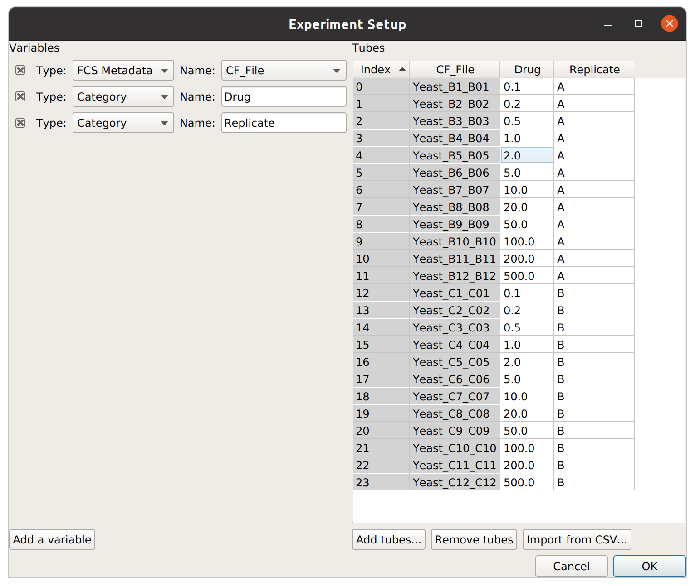

.. _user_import:

HOWTO: Import an experiment from a table
========================================

``Cytoflow`` can allow you to analyze complex flow cytometry experiments,
with many tubes and many conditions. However, describing those tubes and
conditions in the ``Experimental Setup`` dialog can be a pain -- especially 
if you already have that information in a table somewhere.  

Unfortunately, the way I've programmed that dialog box, you can't (yet)
copy-and-paste into it.  Instead, ``Cytoflow`` allows you to *import* 
an experimental design from a CSV (comma-separated values) file, as long as 
it is formatted in the following way:

* The first row is a header; subsequent rows are tubes.

* The first column is the filename.  (If you include paths, they must
  be either absolute paths, or relative to the location of the CSV file.)
  
* Each subsequent column is a variable.  The entry in the header is the
  variable's name, and in subsequent rows the column contains the 
  variable value for that tube.
  
* There is no way to specify the type of variable.  You can change
  the type once it's been imported.

An example will make this clearer.  Let's say I have the following 24 
files:

As is clear from the filenames, they came from two rows of a multiwell
plate.  Let's say that the two rows are replicates, and the amount of
some drug I added increases across each row.  I might open my favorite
spreadsheet editor and create a table like so:

I'll save this as a CSV file *in the same directory as my .FCS files*.
When I import this file in the ``Experimental Setup`` dialog, it looks
like this:

It is important to note that, by default, everything is imported as a
**Category** variable.  In this case, we obviously want ``Drug`` to be
numeric, so I can pull down the "Type" selector for that variable
and change it to "Numeric".  Similarly, if your table has TRUE and FALSE
for values, "TRUE" and "FALSE" will be imported as categories, but you
can change it to a True/False variable by changing the variable type.

