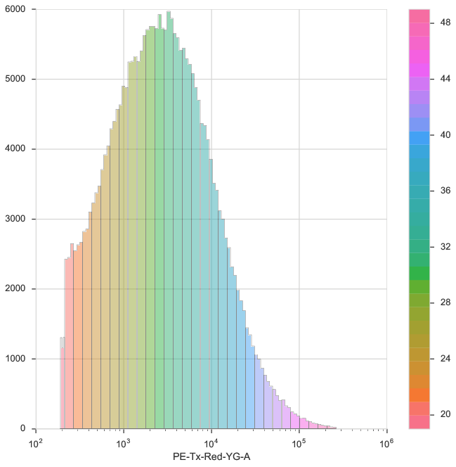

.. _screenshots:

*******************************
Screenshots of the Cytoflow GUI
*******************************

The main GUI.

.. image:: images/gui.png

The experiment editor.

.. image:: images/experiment-editor.png

The plot editor.
 
.. image:: images/plot-editor.png
  
Convert FCS files to calibrated units.

.. image:: images/tasbe.png

One-dimensional Gaussian mixture models.

.. image:: images/gmm.png

Two-dimensional kernel density estimates.

.. image:: images/2d-kde.png

Violin plots to compare distributions.

.. image:: images/violin.png

Calibrate raw data to physical calibrants like beads.

.. image:: images/beads.png

Bin data to analyze subsets.

Summarize data with statistics plots.

.. image:: images/dox-vs-ifp.png

Export straight to a Jupyter notebook.

.. image:: images/notebook.png

