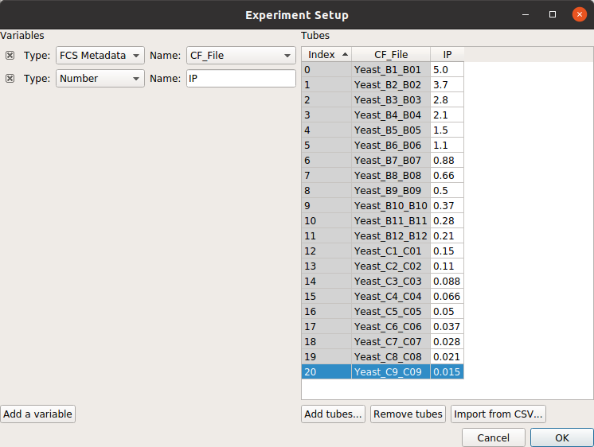
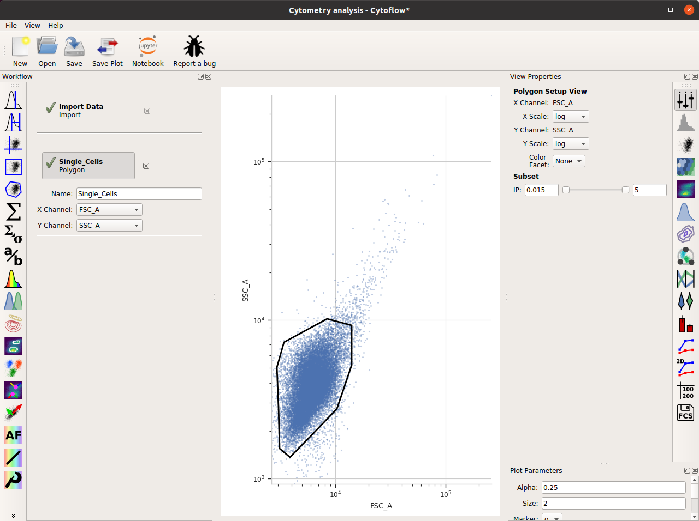
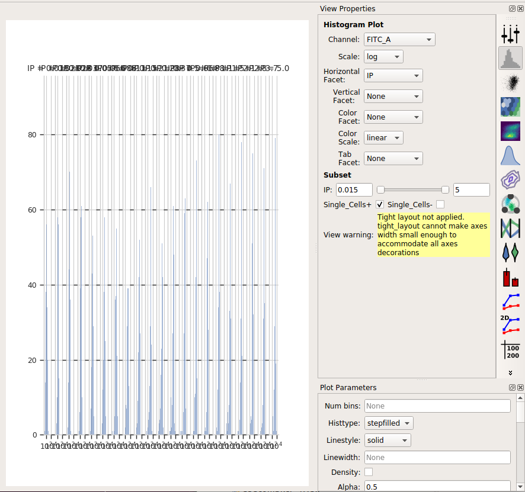
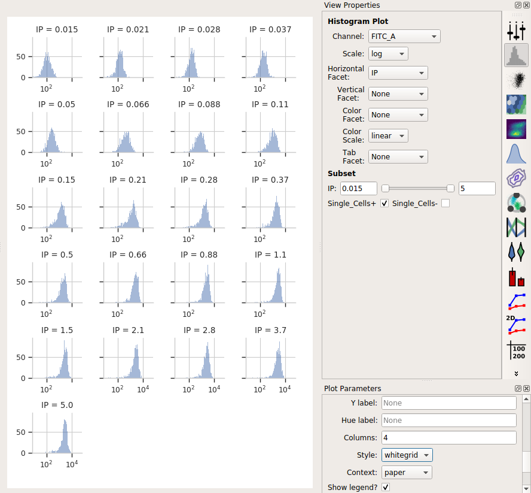
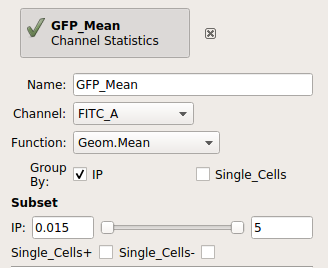
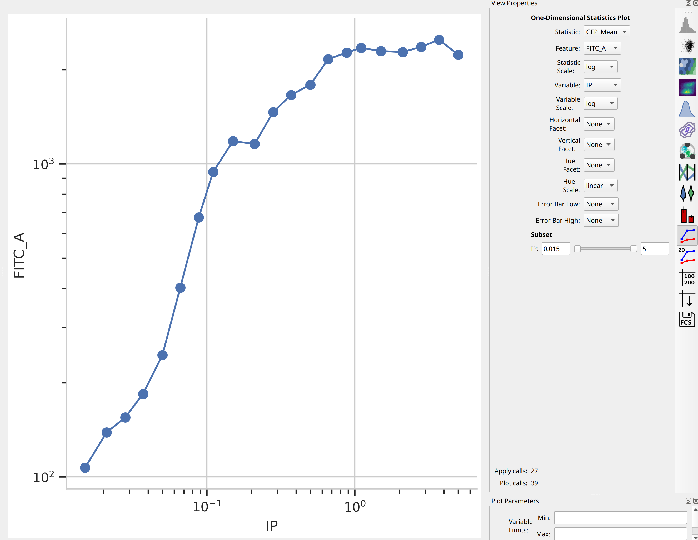
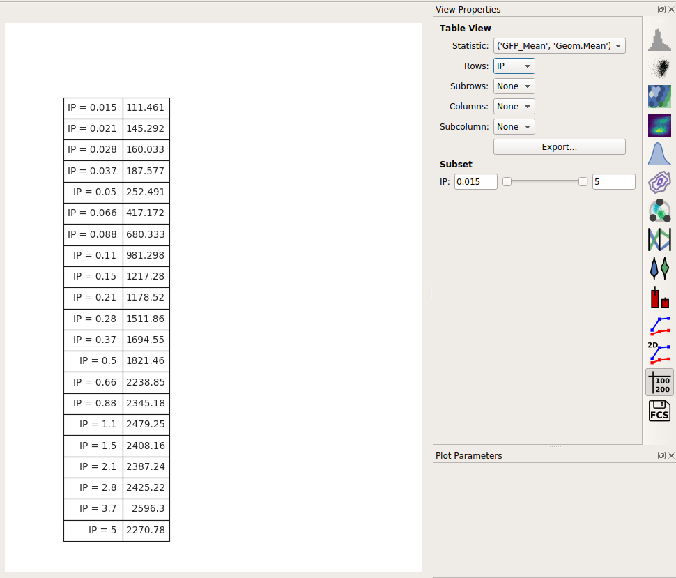
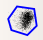

.. _user_dose_response:

Tutorial: Dose-Response
=======================

A common way to use flow cytometry is to analyze a dose-response experiment:
cells were treated with increasing doses of some drug or compound, and we
want to see how the response changed as we increased the amount of the 
compound.  In this case, I'm treating an engineered yeast line with
isopentyladenine, or IP; the yeast cells are engineered with a basic GFP
reporter that is expressed in response to IP.  We measured GFP fluorescence
after 12 hours, at which time we expect the cells to be at steady-state.

(The experiment is described in more detail here:
`Chen et al, Nature Biotech 2005 <http://www.nature.com/nbt/journal/v23/n12/abs/nbt1162.html>`_ )

If you'd like to follow along, you can do so by downloading one of the
**cytoflow-#####-examples-basic.zip** files from the 
`Cytoflow releases page <https://github.com/cytoflow/cytoflow/releases>`_
on GitHub.

Importing Data
--------------

Start ``Cytoflow``.  A workflow always starts with an **Import Data** operation;
click the **Set up experiment button...**

Remember that we need to tell ``Cytoflow`` about the experimental conditions for
each sample we're analysing.  In this case, we only have one experimental variable, 
*IP*.

* Click **Add a variable**
* Change its type to **Number** and its name to **IP**.
* Click **Add tubes...**
* Select all of the tubes whose names start with *Yeast_B1* through *Yeast_C9*.  

  .. note:: Remember, you can select multiple files by holding down the *Control*
            or *Command* key.
            
* Fill in the experimental values for the **IP** column.  I did a serial 
  dilution; use the the table below for reference.
  
  =================  =====
  File               IP
  =================  =====
  Yeast_B1_B01.fcs   5.0
  Yeast_B2_B02.fcs   3.7
  Yeast_B3_B03.fcs   2.8
  Yeast_B4_B04.fcs   2.1
  Yeast_B5_B05.fcs   1.5
  Yeast_B6_B06.fcs   1.1
  Yeast_B7_B07.fcs   0.88
  Yeast_B8_B08.fcs   0.66
  Yeast_B9_B09.fcs   0.5
  Yeast_B10_B10.fcs  0.37
  Yeast_B11_B11.fcs  0.28
  Yeast_B12_B12.fcs  0.21
  Yeast_C1_C01.fcs   0.15
  Yeast_C2_C02.fcs   0.11
  Yeast_C3_C03.fcs   0.089
  Yeast_C4_C04.fcs   0.066
  Yeast_C5_C05.fcs   0.05
  Yeast_C6_C06.fcs   0.037
  Yeast_C7_C07.fcs   0.028
  Yeast_C8_C08.fcs   0.021
  Yeast_C9_C09.fcs   0.015
  =================  =====

At the end, your table should look like this:

.. note:: Filling out these tables can be a pain, especially if you've already
          got this information in a table somewhere else already.  If so, you can
          actually import the table directly, following the instructions at
          :ref:`user_import`
          
Click **Import!** to import the data.

Filter out clumps and debris
----------------------------

Because these cultures were grown on a roller drum, they are
quite uniform in size -- but there are still some clumps.  Let's
filter that out with a polygon gate.

* Click the polygon gate button on the operations toolbar: |POLY|

* Name the gate *Single_Cells* -- so we can refer to this subset later -- 
  and set the X and Y channels to FSC_A and SSC_A.  (These are the forward
  and side-scatter parameters.)

* The initial plot is hard to work with -- on the View pane, change both the
  X and Y scale to **log**.
  
* Draw a polygon around the major population the center of the plot.
  Single-click to set a new vertex; click the last vertex again to close the
  polygon.
  
Here's what my window looks like now:

Look at the FITC_A channel
--------------------------

Let's use a histogram to see if we're seeing a dose-response.  

* Choose the histogram view: |HIST|

* Set the channel to **FITC_A** and the scale to **log**

* Set the **Horizontal Facet** to **IP** -- this will give us one plot for
  each different value of **IP**
  
* To only look at the cells in the **Single_Cells** gate, under **Subset**,
  click the check-box next to **Single_Cells+**
  
The result is the following plot:

We've got so many different values of **IP** that we can't squeeze them all
next to eachother.  However, we *can* ask ``Cytoflow`` to "wrap" them onto
several lines, like the word-wrap on a word processor.  To do so, in the
**Plot Parameters** pane (bottom-right in the default layout), scroll down 
to **Columns** and set it to 4.

Ah, much better.  We can see each plot, and we're clearly seeing an increase.
However, histograms are kind of a terrible way to compare lots of distributions
like this.  A better way is a *violin plot*.

* Choose the violin plot view: |VIOLIN|

* Set the **X variable** to **IP**, the **Y variable** to **FITC_A**, and the
  **Y channel scale** to **log**.  
  
* As above, set **Subset** to **Single_Cells+**

.. image:: images/yeast08.png

I love how a violin plot lets you compare distributions side-by-side.  In this
case, it's very clear that there's a clear dose-dependent response as IP
concentration increases, as well as a clear saturation of the response.

Summarize the dose-response curve on a line plot
------------------------------------------------

Next, let's make a "traditional" dose-response curve with a scatter plot, where 
the X axis shows the amount of IP and the Y axis shows the geometric mean of
the **FITC_A** channel.

.. note:  Why the geometric mean instead of the arithmetic mean?  See 
          :ref:`user_mean` for details.
          
* Add a **Channel Statistics** operation: |STAT|

* Give the new statistic a name -- I called it *GFP_Mean* -- and choose the channel
  we want to analyze (*FITC_A*) and the function we want to apply (*Geom.Mean*)
  
* Now we need to tell ``Cytoflow`` which subsets of our data we want to apply the
  function to.  We want the geometric mean computed for every different value of IP;
  so set **Group by** to **IP**.
  
* Again, we only want to analyze the cells in the *Single_Cells* gate -- so set 
  **Subset** to *Single_Cells+*.
  
At the end, your operation should look like this:

Now that we've made a new summary statistic, we want to plot it!

* Open the **1D Statistics View**: |VIEW|

* Set **Statistic** to the name of the statistic we just created, *GFP_Mean*, and
  set **Feature** to the name of the channel that we computed the statistic on, *FITC_A*.
  
* Set the **Statistic Scale** to **log**.  This is how the plot will scale the Y axis.

* Set **Variable** to the variable we want on the X axis -- in this case, *IP*.

* Set **Variable Scale** to *log* -- this is the scale on the Y axis.

Et voila, a scatter plot:

Export the dose-response curve as a table
-----------------------------------------

Often, we want this data avilable for downstream analyses.  Any statistic
you've computed, you can also export as a table (for imporing into
a spreadsheet or other plotting or analysis tool.)

* Choose the **Table View**: |TABLE|

* Set **Statistic** and **Feature** to the same statistic we were just looking at:
  *GFP_Mean* and *FITC_A*.

* Set *Row* to the variable you'd like to put on different rows.  In this case, there's only
  one, so set it to *IP*.
  
* You can preview the table in the center plot pane.  To export it to a CSV file, click **Export...**

