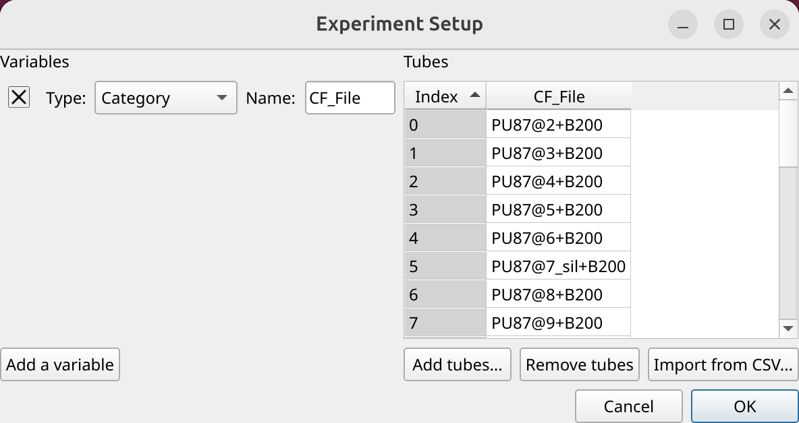
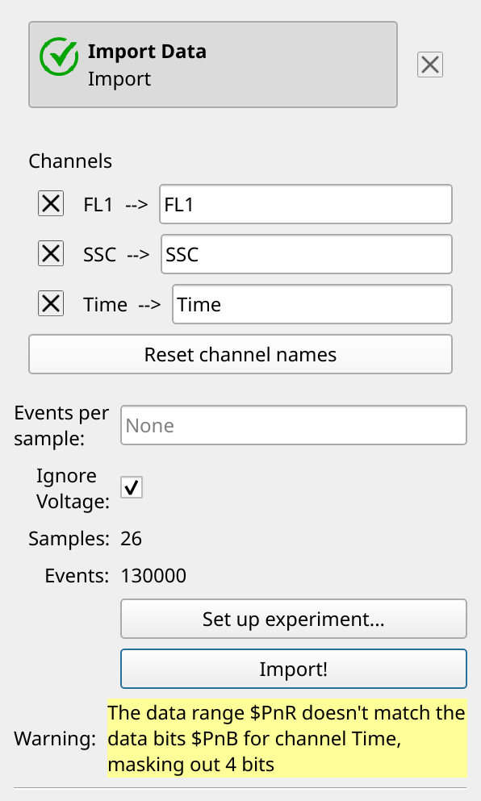
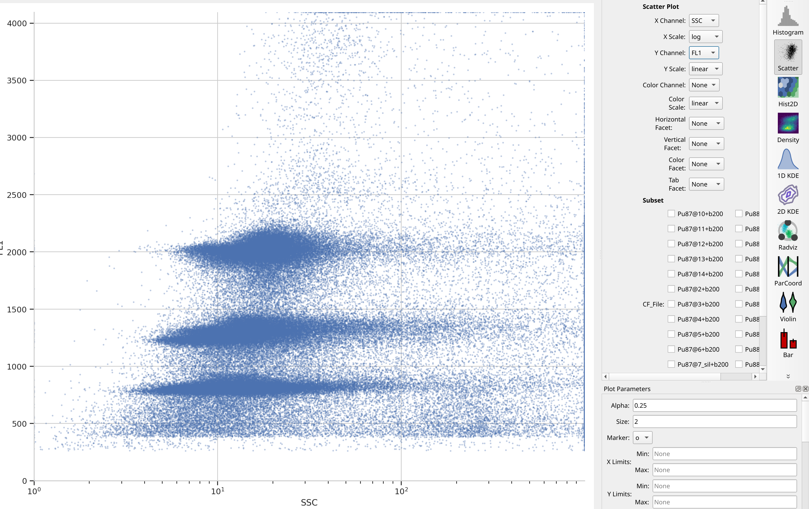
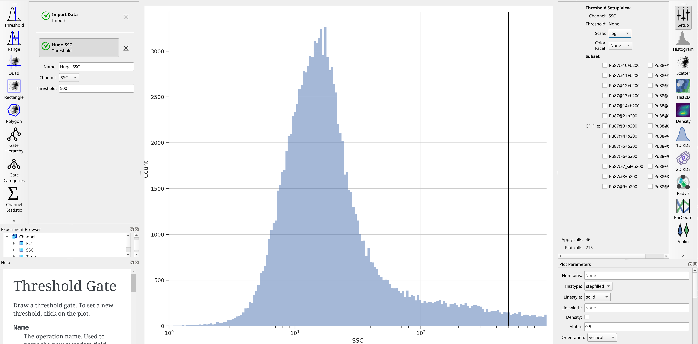
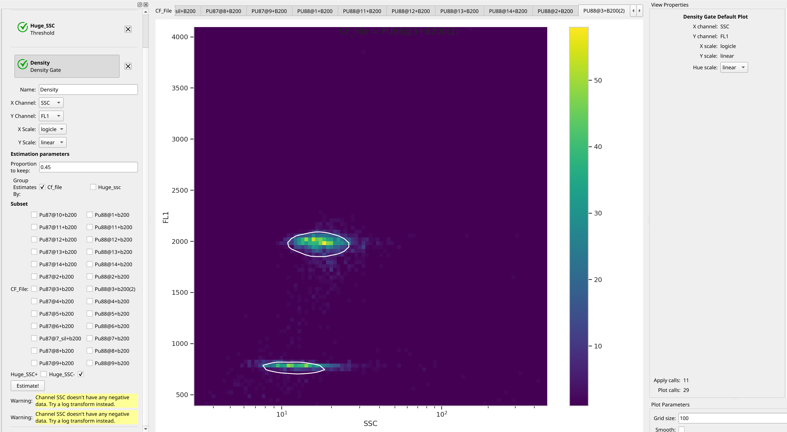
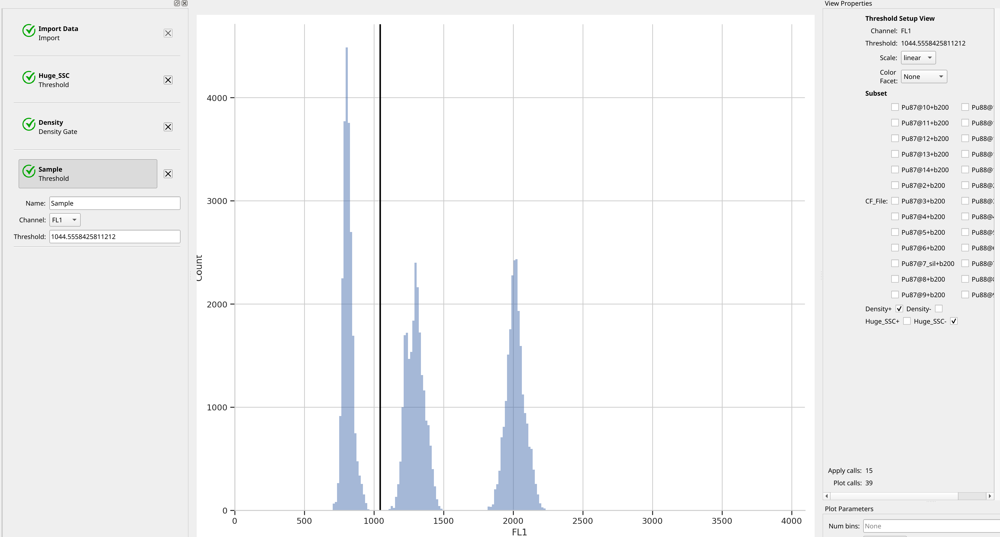
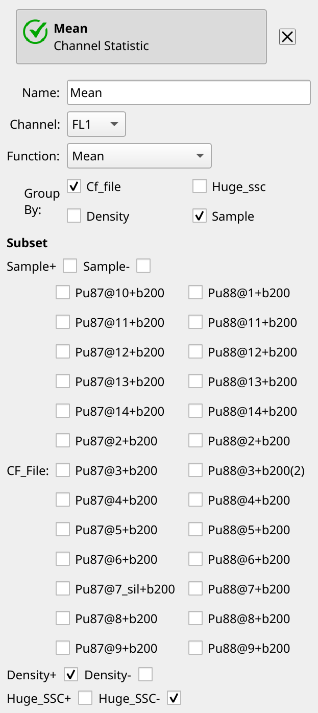
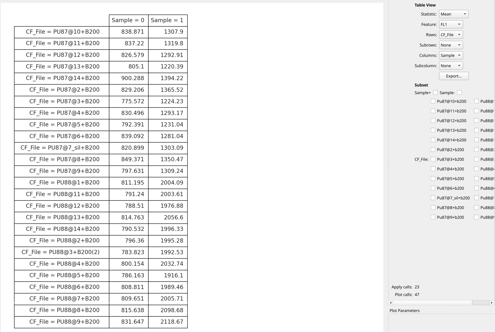

.. _user_genome_size:

Tutorial: Estimating Genome Size
================================
Flow cytometry is regularly used to estimate genome size relative to a standard,
often in plants. Nuclei are isolated from a plant of unknown genome size
and from a plant of known genome size; the samples are mixed, stained with 
a fluorescent DNA-binding dye such as DAPI, and run on a flow cytometer.
The relative fluorescences can be used to estimate the size of the unknown
genome relative to the known one.

This tutorial demonstrates one possible approach. We use data from 
*Kúr et al. Cryptic invasion suggested by a cytogeographic analysis of the*
*halophytic Puccinellia distans complex (Poaceae) in Central Europe.*
*Frontiers in Plant Science 14, 2023*
`DOI: 10.3389/fpls.2023.1249292 <https://doi.org/10.3389/fpls.2023.1249292>`_.
No pre-processing was done -- these are the raw files downloaded from
`the publication's dataset on Zenodo <https://zenodo.org/records/8077314>`_.
I did remove one file whose data looked pretty wonky -- the investigators
do the same with several of their samples.

If you'd like to follow along, you can do so by downloading one of the
**cytoflow-#####-examples-basic.zip** files from the 
`Cytoflow releases page <https://github.com/cytoflow/cytoflow/releases>`_
on GitHub. These data are in the `data/genome_size` subfolder.

Import the data
---------------

Open the experiment setup panel and select all of the files. (Remember, you can
click the first, then shift-click the last, to select multiple files.)
Because we don't have any metadata besides the filename, change the **CF_File** 
column type to **Category** and click **OK**.

Usually **Cytoflow** imposes a constraint that a channel's voltages are the
same for each FCS file it imports. With care, this can allow you to compare
quantitative measurements across FCS files. However, occasionally you need
to relax this constraint, and this is one of those times -- a few of these
FCS files have slightly different voltages. However, because the standard
is *spiked into each sample*, we can safely proceed. So, enable
**Ignore Voltages** and click **Import**.

.. note:: 
   You can safely ignore the warning. Occasionally an instrument manufacturer's 
   software saves files a little strangely. **Cytoflow** knows about a lot of 
   these issues and fixes them for you, but it will also warn you that the data 
   it is analyzing is not exactly the data in the FCS files.

Take a look at the data
-----------------------

It's always good to start with some basic data exploration. Here, there are
only two channels saved (in addition to **Time**), so have a look at the
scatter plot. Notice that there are three major clusters -- the lower ``FL1``
cluster is our internal standard, and the higher two clusters are the nulcei
we're trying to estimate. There's also quite a bit of noise, which might make
that estimation inaccurate -- we'll think about that in a minute. 

.. tip::
   Remember that unless you facet or subset your plot -- which we're not doing
   here -- you're looking at the *whole* data set, *all* of the tubes together
   on one plot.
   
Gate out the high SSC events
----------------------------

Let's at least get rid of the saturating events on the SSC channel. To do so,
create a **Threshold** gate, name it ``Huge_SSC``, set the channel to ``SSC``
and set the threshold to 500.

Find the peaks with a density gate
----------------------------------

Let's assume, for the minute, that we don't want to draw 40 different gates to find
the two peaks in each of our 20 samples. What to do? **Cytoflow** includes several
automated clustering algorithms, and the one that works best in this situation
is a **Density Gate**. The user selects how much of the data they would like
to retain, and this gate selects that proportion of events in the highest-density
regions of a 2D plot. Most important for our use, *we don't have to use the same*
*gate for the entire data set.* Like most data-driven operations, the 
**Density Gate** lets you group the data by some condition or piece of metadata
before estimating the operation's parameters. In this case, we'll compute a
*different* gate for each tube.

Let's keep 45% of the data -- you'll see why in a moment. Name the gate 
``Density`` and gate on the ``SSC`` and ``FL1`` channels, same as the 
scatterplot. Change the **X Scale** from ``log`` to ``logicle``, though. To make 
a different gate for each tube, set **Group Estimates By** to **Cf_file**. And 
make sure you choose **Huge_SSC-** under **Subset** to ignore the events with 
huge SSCs.

Glance through the plots and see what the **Density Gate** operation has done:
it has found the peaks for each tube! Even when those peaks moved! And now
we can see why I used 45% -- this was a value that found both peaks in all
of the tubes.

.. note::
   While a data-driven operation such as **Density Gate** can estimate different
   *model parameters* for each subset -- as it did here, a different gate for
   each tube -- the *operation parameters* must be the same for each subset.
   For example, you can't keep 45% of the events for one tube and 60% for 
   another.
   
.. note::
   Why change the X scale? This was another issue I caught as I scrolled through
   the gates -- there was a gate with strange behavior with events with very
   small SSCs. I could have gated them out, I suppose, or I could change the
   scale -- ``logicle`` behaves much better around 0 than ``log`` does.
  
Separate the control and the sample peak
----------------------------------------

We've found the peaks, but if we want to summarize the different peaks' means
separately, we need to separate them. Let's do so with another threshold
gate -- this one I'll name ``Sample``, to distinguish the sample from the control.

Note that in the setup view, I've selected ``Density-`` -- this hides all the
events that weren't in the peaks and cleans up the plot substantially.

Compute the peaks' means
------------------------

We're almost done. Recall that in **Cytoflow**, if we want to summarize some 
flow data, we do so by creating a *statistic*. So let's create one using the
**Channel Statistic** operation. Name it ``Mean``, set the channel we're
summarizing to ``FL1``, and the function to ``Mean``. Group by *both*
``Cf_file`` *and* ``Sample`` -- we want *both* peaks' means -- and set the 
subset to ``Density+`` and ``Huge_SSC-``. There's no **Estimate!** button --
the operation updates each time you change a setting.

Finally, we can view our statistic using the **Table** view. Each of the 
conditions we grouped the statistic computation by becomes a "variable"
(technically, a *facet*) in the new statistic, and we can assign each to
the rows or columns (or subrows or subcolumns) in the table. In this
case, let's put each file on a row and each value of ``Sample`` on
a column.

Recall that ``Sample = 0`` are the internal control peaks, and ``Sample = 1``
are the unknown peaks. A little more math in a spreadsheet program will
find the ratio between the two and convert to ``pg DNA per nucleus``.

.. tip::
   Remember, you can export this table to a CSV file with the **Export** button!
   
 

 

   