.. _user_hierarchical:

Tutorial: Hierarchical Gating
=============================
A common strategy for manual gating is hierarchical gating -- a skilled 
cytometrist examines sets of one- or two-dimensional plots, one after another, 
to separate cells into "positive" and "negative" populations. While I like to 
think that modern cytometry has better, less biased tools to accomplish this 
task, it is still a necessary one in many contexts, and Cytoflow supports it.

This tutorial demonstrates a hierarchical gating scheme from 
*Saeys Y, Van Gassen S, Lambrecht BN. Computational flow cytometry: *
*helping to make sense of high-dimensional immunology data.* 
*Nature Reviews Immunology 16:449-462 (2016).* 
Our question here is a basic one -- what is the count of each cell type in each
tube in the six tubes in the experiment? The data were downloaded from the 
`Sayes Lab github <https://github.com/saeyslab/FlowSOM_workshop>`_ and 
compensated using the bleedthrough matrix in the provided FlowJo workspace 
before being re-saved by Cytoflow -- no other data preprocessing was applied.

We want to quantify NK, NK T, T and B cells; neutrophils, DCs, basophils, and 
macrophages. The markers (and the channels they were measured in) are in the 
table below (also from the Sayes lab github). Per 
`the FlowRepository metadata <https://flowrepository.org/experiments/833>`_, 
these cells were splenocytes from wild-type C57Bl/6 mice.

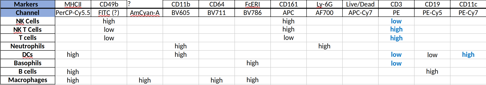

If you'd like to follow along, you can do so by downloading one of the
**cytoflow-#####-examples-basic.zip** files from the 
`Cytoflow releases page <https://github.com/cytoflow/cytoflow/releases>`_
on GitHub.

One final note. **I am not an immunologist.** This is an explanatory example,
using publically available data, to illustrate the software's functionality.
*Please* don't write me and tell me I'm using the wrong markers or the
wrong dyes.

Import the data
---------------

Open the experiment setup panel and set it up as in the image below. We
would usually include metadata to make the analysis more biologically 
meaningful, but I don't know how (or if) any of these tubes is different.

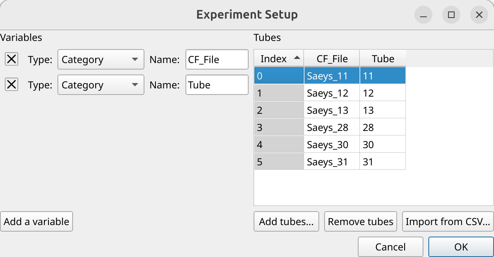

However, we *can* replace the (uninformative) channel names with the (more
informative) markers. (Unfortunately, the metadata on FlowRepository did not say
what the *AmCyan* or *Pacific Blue* channels were used for, and the *FITC* 
channel appears to be unused.)

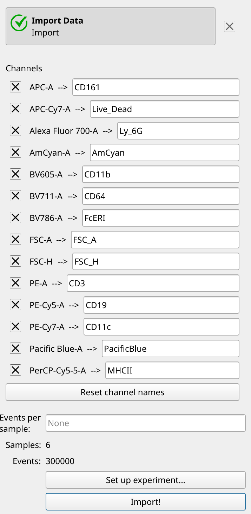

Gate single cells and live cells
--------------------------------

First, we'll use a *Polygon Gate* to select single cells, gating out clumps
and debris. Following the gating in the example data, we'll gate with *FSC_A*
and *FSC_H* channels on a linear scale.  And since there are quite a lot of 
events in this data set, we'll use the *Density Plot* mode (with a *log* color 
scale) so we can see what 
we're doing.

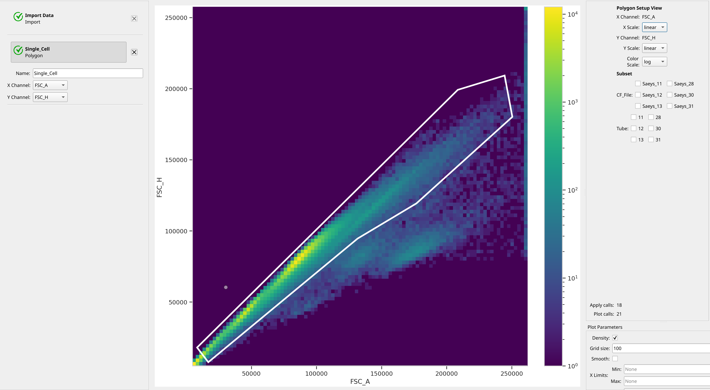

Next, we'll gate out the live cells with the live-dead marker. The metadata 
didn't say which stain was used, but recall that *dead cells are positive*.
We'll put the linear-scaled *FSC_A* channel on the X axis and the logicle 
(biexponential)-scaled *Live_Dead* channel on the Y axis. Again, we'll use the 
*Density Plot* mode of *Polygon Gate* to choose the live cells.  Increasing
the grid size can also make it a little easier to see what we're doing.

.. image:: images/hierarchical05.png

Create Immune Cell Phenotype Gates
----------------------------------

Now, let's create *Polygon Gates* for each immune cell phenotype. Note that
this is not a **strictly** hierarchical approach, because each gate I draw will
only be on the *Single_Cell+* and *Live+* plots. The final analysis will
be hierarchical, though, as we will see shortly.

We start with *Macrophages*, which are *CD64+* and *AmCyan+*. (Remember, I don't
know what marker is being measured in the *AmCyan* channel....)

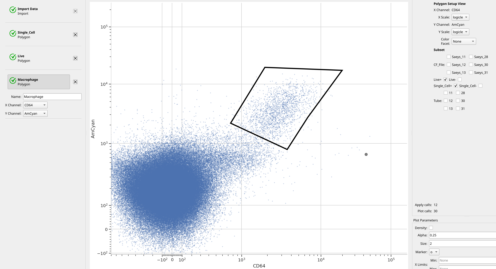

*B cells* are **CD19+** and **CD3-**.

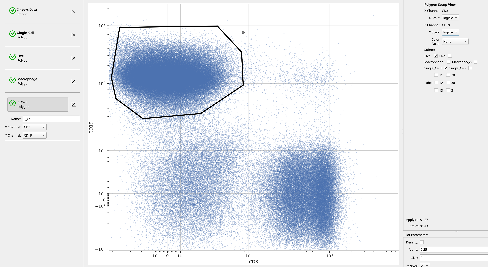

*CD3* and *CD161* can distinguish *NK*, *NK T* and *T Cells*.

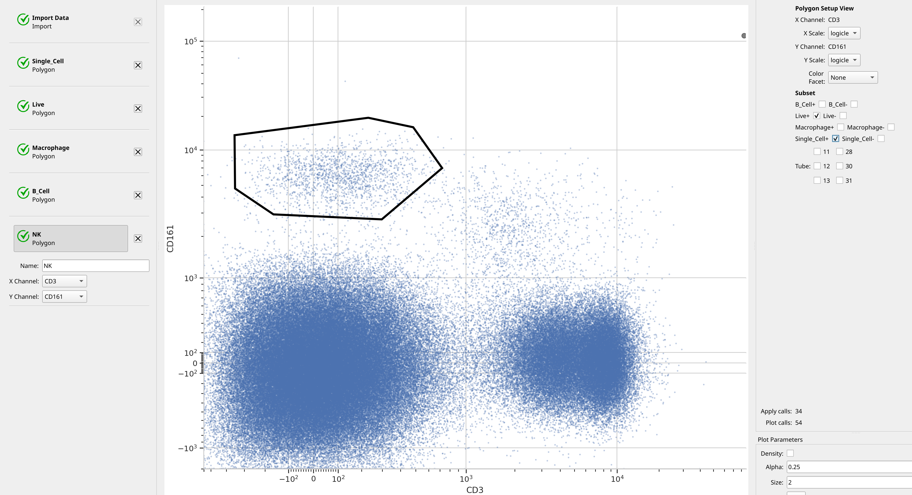

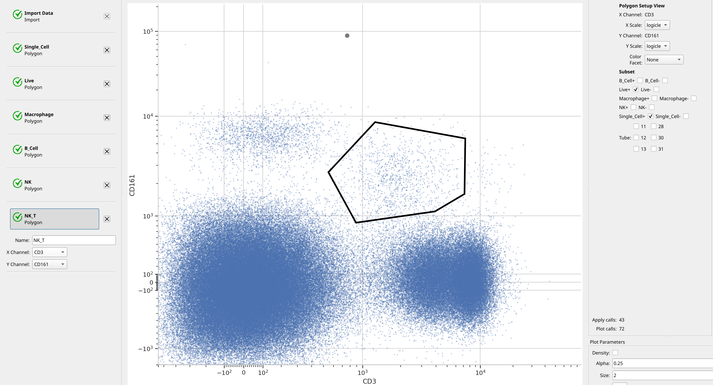

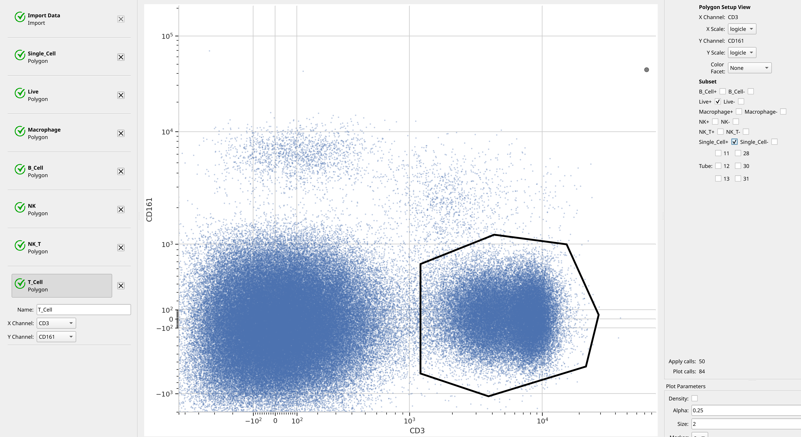

Almost done. *DCs* are *CD11c+* and *MHCII+*. And let's use a density plot,
for giggles.

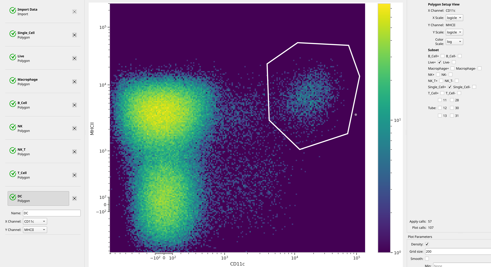

*Neutrophils* are *Ly_6G+* and *CD11b+*.

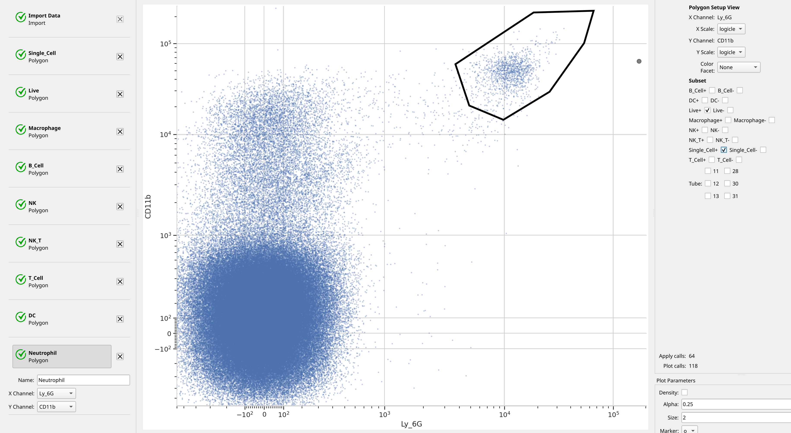

And finally, *Basophils* are *FcERI+* and *Pacific Blue+*. (Again, I don't know
what marker is on the *Pacific Blue* channel.)

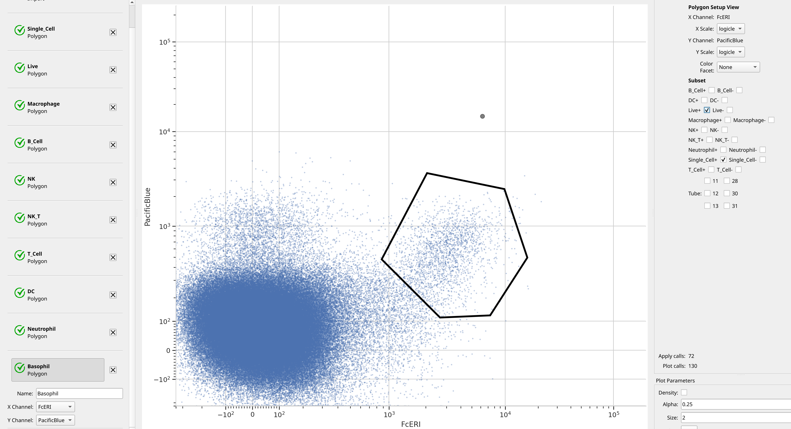

Analyze the hierarchy
---------------------

The way *Cytoflow* allows you to analyze a hierarchical gating scheme is by
creating a new *condition* using the *Gate Hierarchy* operation. As we will see,
you specify an **ordered list** of gates, the values of those gates, and
the labels you'd like to assign to events in each gate. A label in the new
condition is assigned for each event in the following manner:

- Membership in the first gate is evaluated. If the event's value is the same
  as the one specified, it gets the first label. 
- If not, then membership in the second gate is evaluated. If the event's value
  is the same as the one specified, it gets the second label.
- This process continues until we're out of gates. In this case, the event's
  label is assigned some default value, often "Unknown".
  
So, set up the *Gate Hierarchy* operation as below:

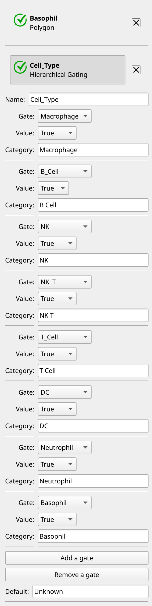

Now we've got a new condition called *Cell_Type* that implements our
hierarchy, and we can compute statistics as usual. For example, we can
count the cells in each category in each tube with a *Channel Statistic*
operation. Note how we're grouping by **both** *Cell_Type* **and** *Tube*,
and *only* counting *Live* and *Single_Cell* cells.

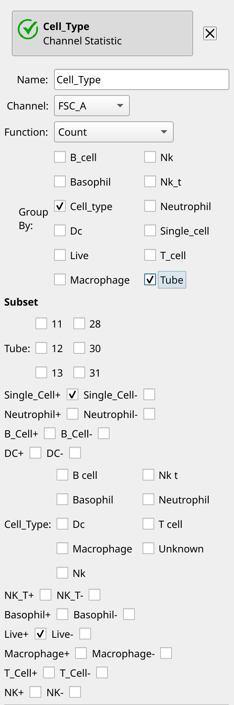

We can look at the new statistic as a table:

.. image:: images/hierarchical16.png

We can also make pie plots using the *Matrix* view:

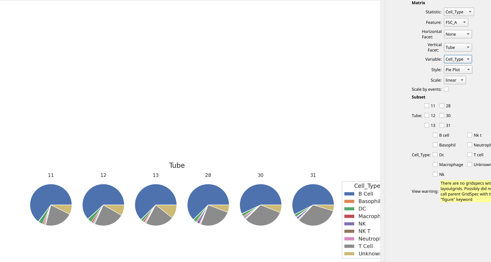

 

 
