.. _user_induction:

Tutorial: Yeast Multidimensional Induction Timecourse
=====================================================

This workflow demonstrates a real-world multidimensional analysis.  The yeast
strain we're studying responds to the small molecule *isopentyladenine* (IP) 
by expressing a green fluorescent protein, which we can measure using a flow
cytometer in the *FITC-A* channel.

This experiment was designed to determine the dynamics of the IP --> GFP
response. I induced several yeast cultures with different amounts of IP,
then took readings on the cytometer over the course of the day, every 30
minutes for 8 hours.  The outline of the experimental setup is below.

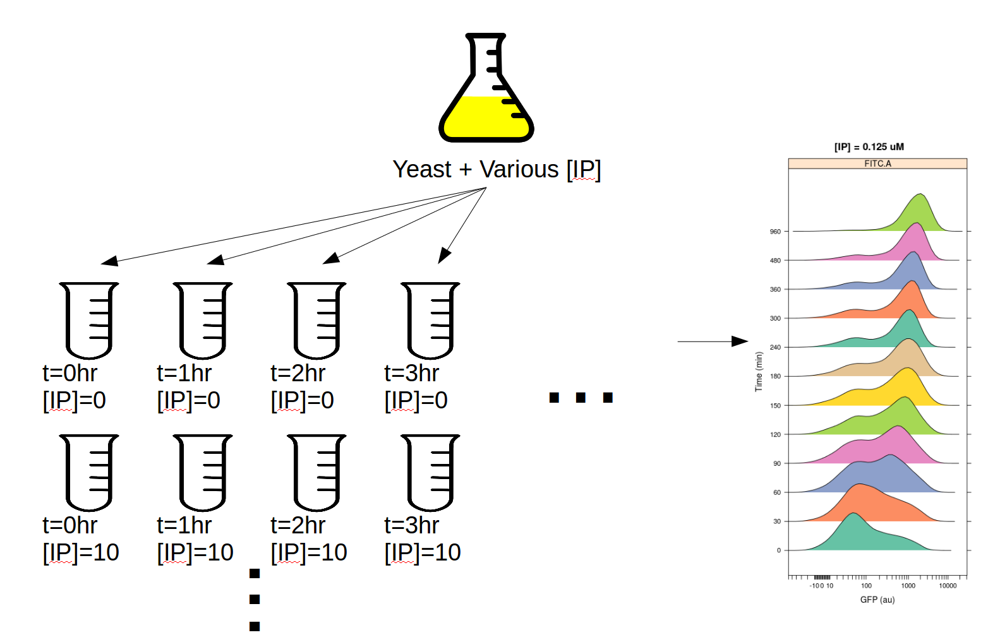

If you'd like to follow along, you can do so by downloading one of the
**cytoflow-#####-examples-advanced.zip** files from the 
`Cytoflow releases page <https://github.com/cytoflow/cytoflow/releases>`_
on GitHub.  The files are in the **yeast/** subdirectory.

.. warning:: This is a pretty big data set; on modest computers, the operations
             can take quite some time to complete.  Be patient!

Import the data
---------------

* Start Cytoflow. Under the **Import Data** operation, choose **Set up experiment...**

* Add two variables, *IP* and *Time*. Make both of them *Number* s.

* In this case, I've encoded the amount of IP and the time (in minutes) in the
  FCS files' file names.  For example:
  
  =================  =====  =======
  File               IP     Minutes
  =================  =====  =======
  IP_0.0_Minutes_0   0      0
  IP_0.05_Minutes_0  0.05   0
  ...                ...    ...
  IP_0.0_Minutes_30  0      30
  ...                ...    ...
  =================  =====  =======
  
  .. note:: There are a *lot* of rows in this table.  Three things can make setting
            up these kinds of experiments easier:
            
            - If you already have the details in a table, you can import that 
              table by following the instructions at :ref:`user_import`. 
              
            - You can select multiple cells in the table to edit at once by 
              holding **Control**  or **Command** and clicking multiple cells.
            
            - *Cytoflow* looks at the files' *metadata* and offers to let you
              use metadata that differs between tubes as experiment conditions.
              In this instance, once you load all the tubes, you can create 
              two new variables of type *FCS Metadata*, then choose 
              *CF_IP* and *CF_Minutes* to load the metadata as variables. You'll 
              need to change both of their types to *Number* and rename them to 
              *IP* and *Minutes* if you want your screen to match the 
              following tutorial.
            
  .. warning:: It is generally not a good idea to name a variable **Time**,
               because most flow cytometers produce FCS files with a **Time**
               "channel" and you can't re-use those names!
            
At the end, your table should look like this:

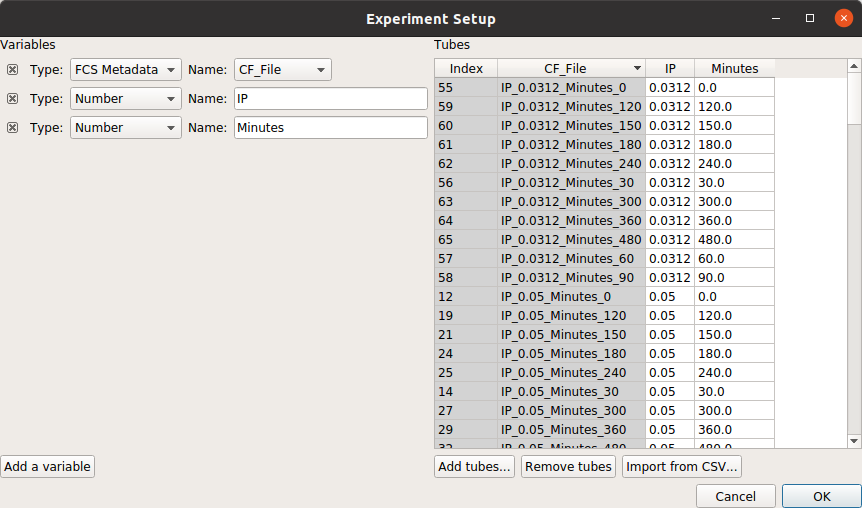

Go ahead and click **Import!** to import the dataset.

Filter out clumps and debris
----------------------------

Let's have a look at the morphological parameters, *FSC-A* and *SSC-A*.  There
are so many events in this data set that a standard scatterplot isn't a great 
choice:

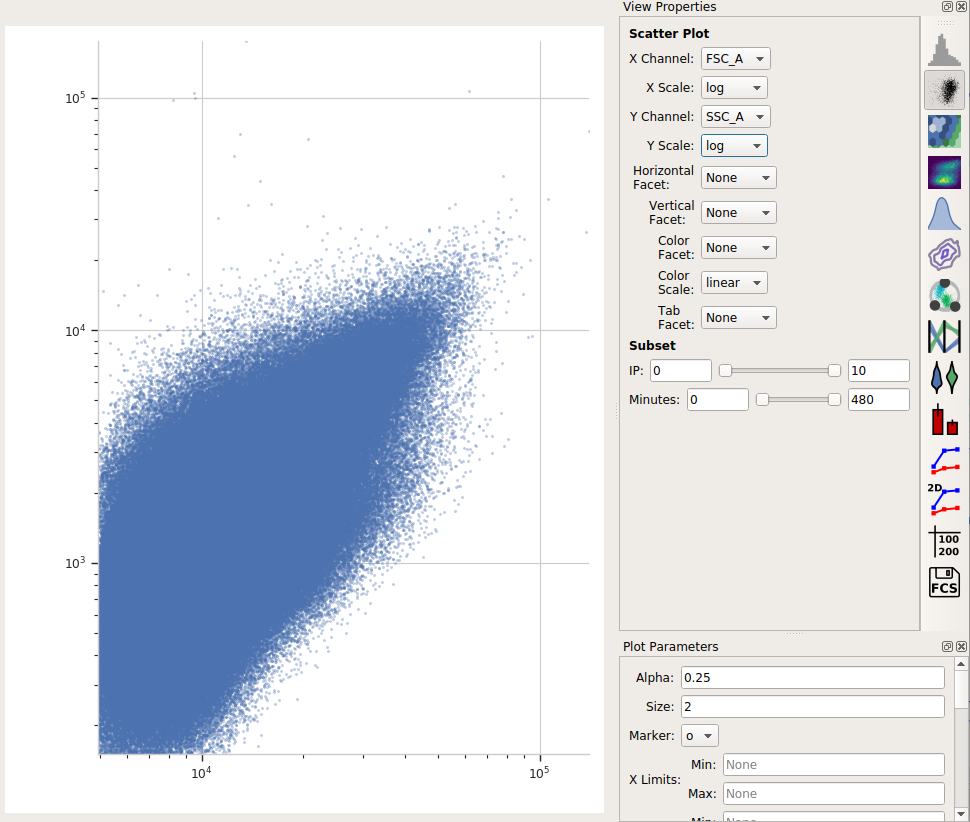

Instead, let's use a density plot.  

* Click the density plot button: |DENSITY|

* Set the **X channel** to **FSC_A** and the **Y channel** to **SSC_A**.  Change
  both axis scales to **log**.
  
  .. image:: images/induction05.png

This distribution looks quite tight.  Instead of drawing a polygon, let's use a
density gate to keep the 80% of events that are in the "center" of this
distribution.

* Add a **Density Gate** operation to your workflow: |DENSITY_GATE|

* Set the name to **Single_Cells**.

* Set **X channel** to **FSC_A** and **Y Channel** to **SSC_A**.  Change both
  axis scales to **log**.  By default, the operation keeps 90% of the events;
  let's change that to 80% by setting **Proportion to keep** to *0.8*.
  
* Click **Estimate!** and check the diagnostic plot to make sure that the gate
  captures the population you want:
  
  .. image:: images/induction07.png

Compute the geometric mean at each different timepoint and IP concentration
---------------------------------------------------------------------------

Next, we'll create a new **Channel Statistic** to compute the geometric mean
of the **FITC_A** channel at each timepoint and IP concentration.

.. note:: Why the geometric mean? See :ref:`user_mean`

* Add a **Channel Statistics** operation: |STAT|

* Give the new statistic a name -- I called it *GFP_Mean* -- and choose the channel
  we want to analyze (*FITC_A*) and the function we want to apply (*Geom.Mean*)
  
* Now we need to tell ``Cytoflow`` which subsets of our data we want to apply the
  function to.  We want the geometric mean computed for every different value of IP
  *and* timepoint; so set **Group by** to **IP** *and* **Minutes**.
  
* Again, we only want to analyze the cells in the *Single_Cells* gate -- so set 
  **Subset** to *Single_Cells+*.

At the end, your operation should look like this:

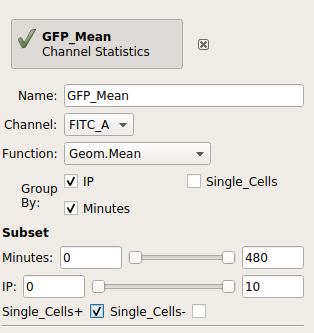

Now that we've made a new summary statistic, we want to plot it!

* Open the **1D Statistics View**: |VIEW|

* Set **Statistic** to *GFP_Mean* (the name of the statistic we just created) and
  set the **Feature** to the channel we computed the statistic on, *FITC_A*.
  
* Set the **Statistic Scale** to **log**.  This is how the plot will scale the Y axis.

* Set **Variable** to the variable we want on the X axis -- in this case, *Minutes*.

* Set **Hue Facet** to the variable we want plotted in different colors -- in this case, *IP*.

* The IP concentrations were a standard dilution series, so change the **Hue scale** to **log**.

Et voila, a scatter plot:

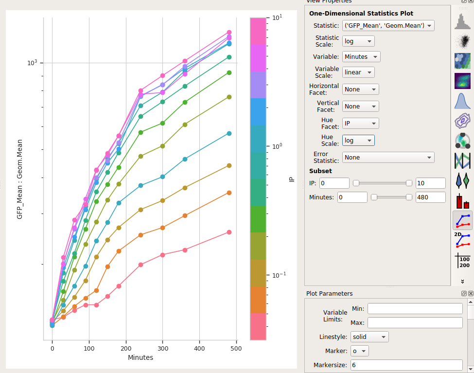

Is a geometric mean an appropriate summary statistic?
-----------------------------------------------------

A geometric mean is only an appropriate summary statistic if the unimodal in 
log space. Is this actually true? Let's look at the histogram of each 
IP/time combination to find out.

* Choose the histogram view: |HIST|

* Set the **Channel** to **FITC_A**, the **Scale** to *logicle*, the **Horizontal facet**
  to *Minutes* and the **Vertical facet** to *IP*.

* Set **Subset** to *Single_Cells+*

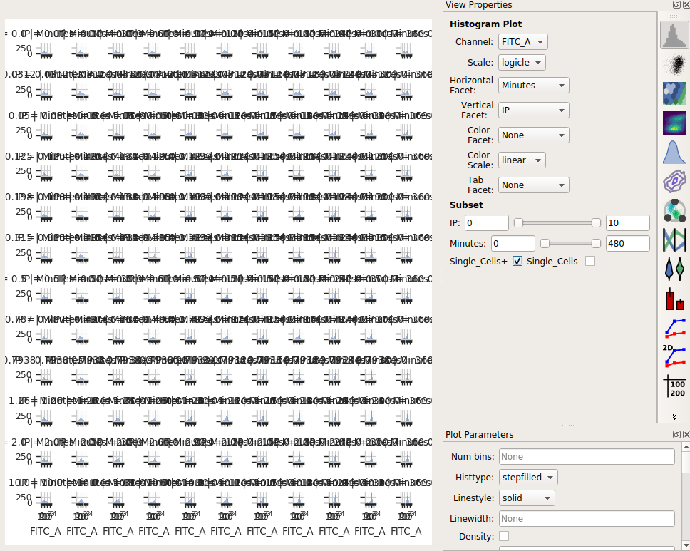

Eeep, that's impossible to read!  Instead, let's put the *IP* variable on the *Hue* axis,
and then use the **Columns** parameter to give us a table of plots.  We'll also change
to a **1D Kernel Density Estimate**, which will give us smoothed lines instead of 
jagged histograms.

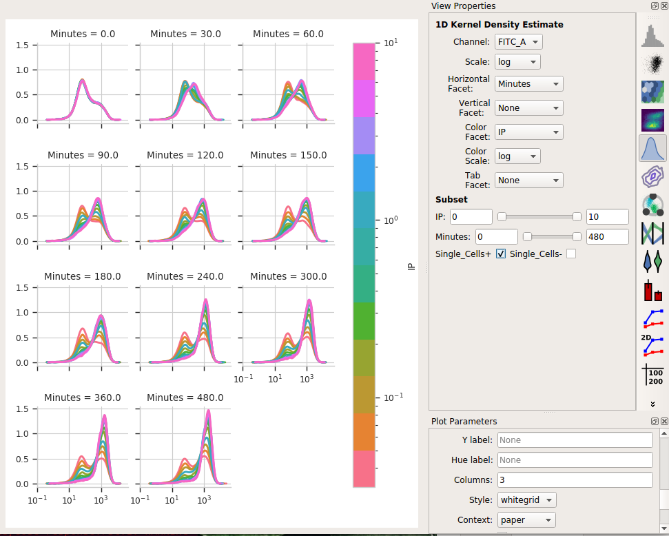

Okay, now *this* is interesting.  Many of these distributions are *not* unimodal.
Instead, there's significant additional structure.  It's almost like there are two 
populations of cells in each tube -- on that's "off" and one that's "on" -- and different
amounts of IP and time change the proportion of cells in each population.

Model the data as a mixture of gaussians
----------------------------------------

It turns out that this "mixture of Gaussians" thing is sufficiently common in
cytometery that ``Cytoflow`` has a module that can handle it explicitly.  Let's
have ``Cytoflow`` model each IP/time subset as a mixture of two gaussians and 
see if that's more informative than the simple dose-response curve.

* Add a **1D Mixture Model** to your workflow: |1DMM|

* Set the name to something reasonable -- I chose *GM_FITC* -- and the channel
  to *FITC_A* and the scale to *log*.
  
* We want a model with two components, so set **Num components** to 2.
  
* We want a *separate* model fit to each subset of data with unique values of
  *IP* and *Minutes*.  So, set **Group estimates by** to **IP** *and* **Minutes**.
  
* We only want to estimate the model from the cells in the *Single_Cells* gate --
  so set **Subset** to **Single_Cells+**.
  
  Your operation should look like this:
  
  .. image:: images/induction16.png
  
* Click **Estimate!**

You can page through the tabs on the plot to look at the various models that were
fit.  For example, here's the IP=0.05, Minutes=300 tab:

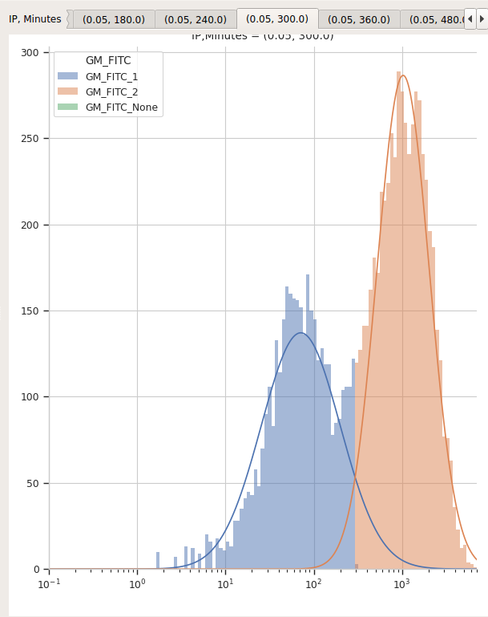

I'd say that's a pretty good fit!

It's important to note that *most data-driven operations* **also** *add statistics*
that contain information about the models they fit.  In this case, the 
**1D Mixture Model** operation creates a new statistic whose name is the same as
the operation name (in this case, *GM_FITC*) with a new level named *Component*
and features that include *Mean* and *Proportion*. These contain the mean and 
proportion for each component for each data subset.  

First, let's see if the means actually do stay the same for the two components:

* Select the **1D Statistics View** |VIEW|

* Set **Statistic** to *GM_FITC* and **Feature** to *FITC_A Mean*. 

* Set **Statistic scale** to *log*.

* Set **Variable** to *Minutes*.  Leave the **Variable Scale** as *linear*.

* Set the **Hue facet** to *IP* and change the **Hue scale** to *log*.

* The tabs at the top of the plot window will show you the results for the
  different components.  (Note that I also set the Y axis minimum to "10").
  
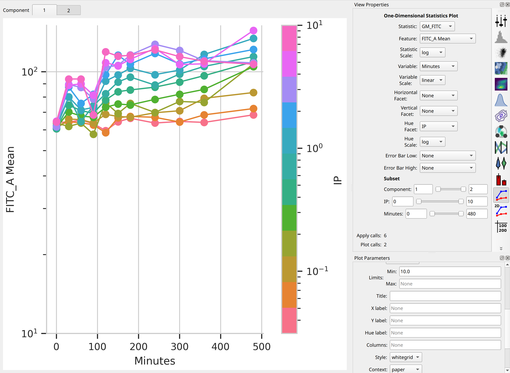
  
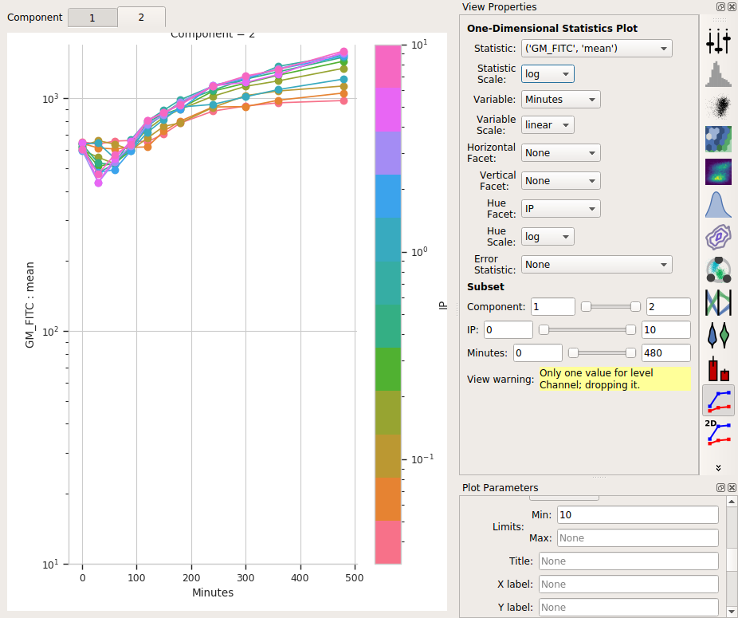

So the means stay pretty constant?  They change a lot less than the geometric
mean does, at least.  A little increase over time -- about 5-fold -- for the
"high" population, and a more-chaotic but still some increase over time for
the "low" population.

Second, let's see if the proportion in the "high" component changes:

* Change **Feature** to *Proportion*

* Change the **Statistic scale** back to *linear*.

* Leave the **Variable** set to *Minutes*, the **Variable scale** on *linear*,
  the **Hue facet** on *IP* and the **Hue scale** on *log*.
  
* If you changed the Y axis minimum, reset it to nothing (default).

* Select Component *2* in the tabs at the top of the plot window.

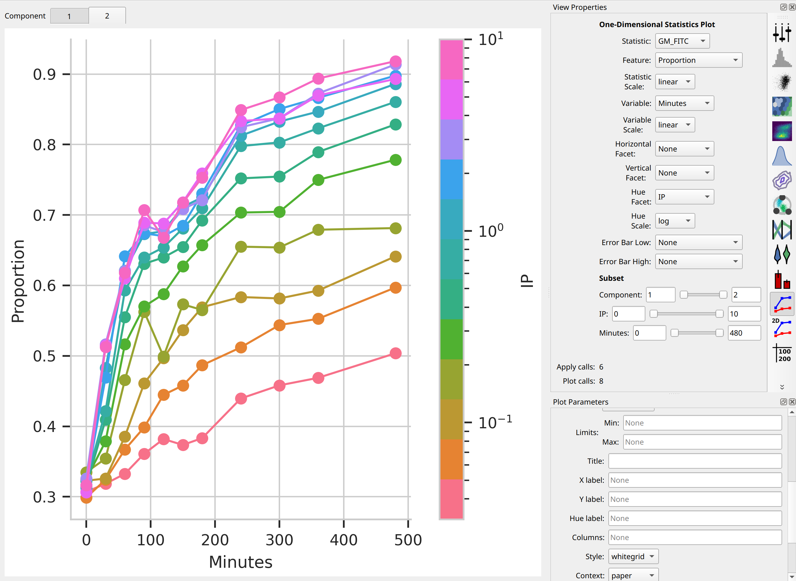

I think those dynamics look significantly different. For one thing, 
the mixture model "saturates" much more quickly -- both in time and in IP. 
The geometric mean model indicates saturation at about 5 uM, while the 
mixture model seems to saturate one or two steps earlier. 
Things also stop changing quite as dramatically by about 240 minutes, 
whereas the geometric mean hasn't reached anything like a steady state
by 480 minutes (the end of the experiment.)

I hope this has demonstrated a non-trivial insight into the dynamics 
of this biological system that are gained by looking at it through a 
quantitative lens, with some machine learning thrown in there as well.

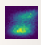

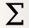

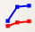

