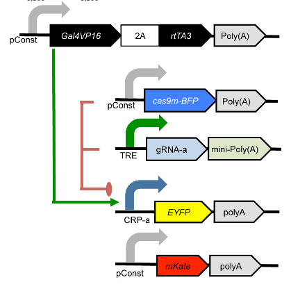
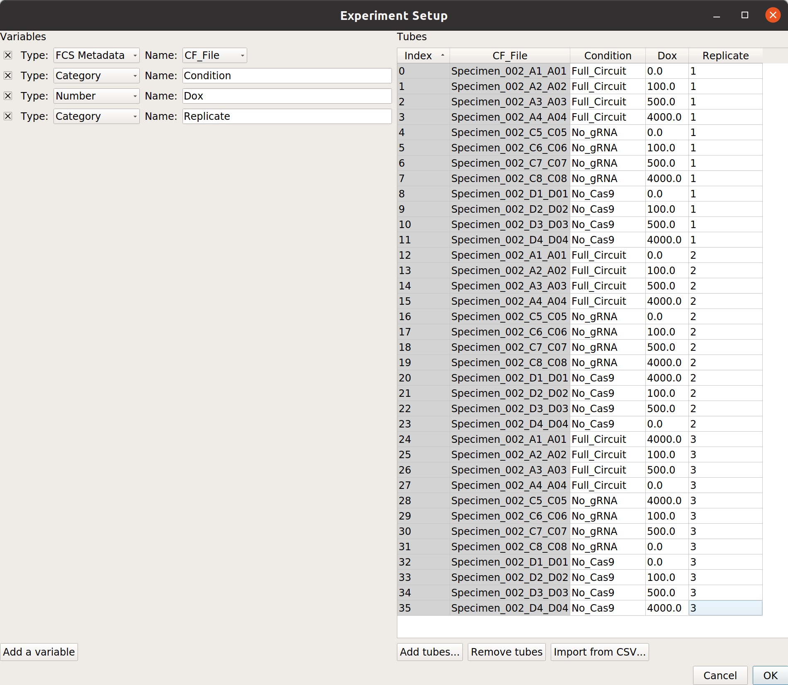
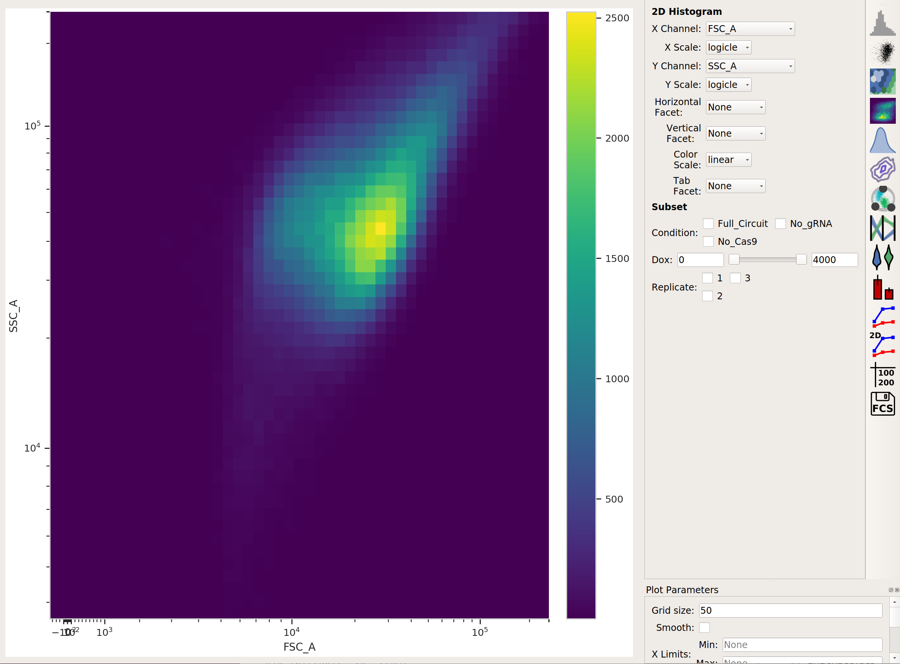
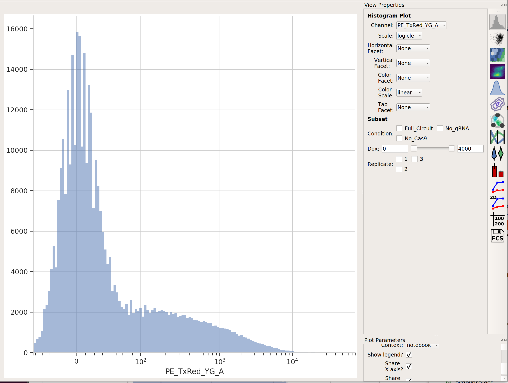
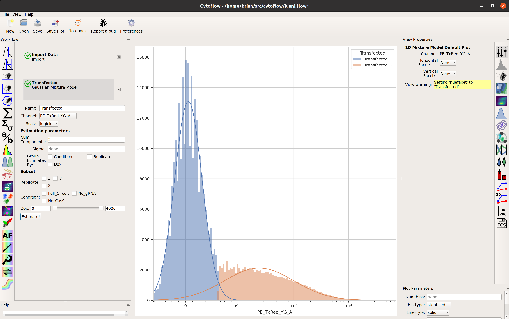
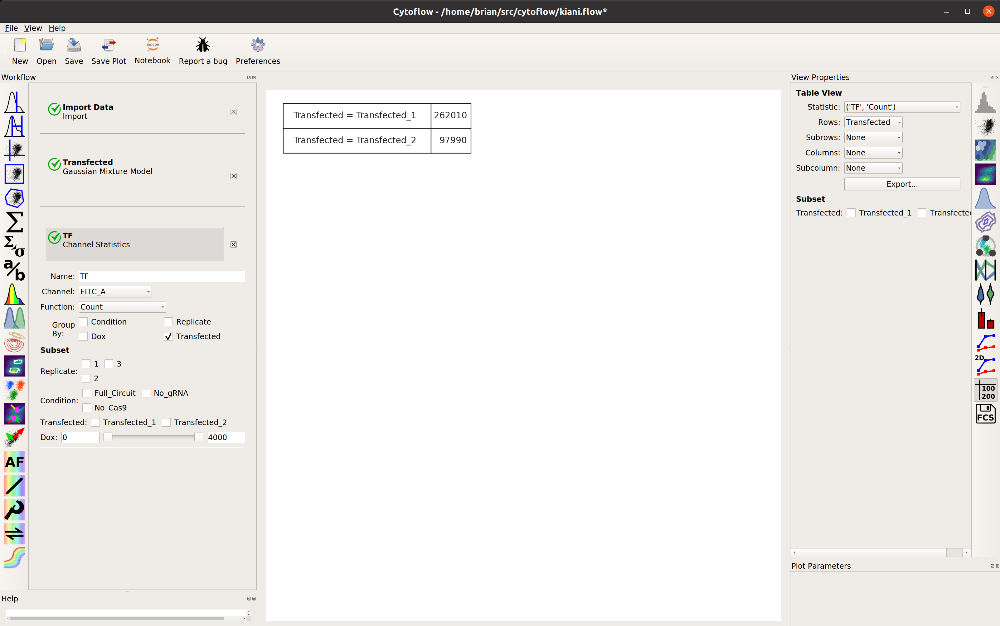

.. _user_kiani:

Tutorial: Synthetic Gene Logic Network
======================================

This example reproduces Figure 2, part (a), from 
`Kiani et al, Nature Methods 11: 723 (2014). <http://www.nature.com/nmeth/journal/v11/n7/full/nmeth.2969.html>`_
This experiment uses a dCas9 fusion to repress the output of a yellow fluorescent 
reporter. The dCas9 is directed to the repressible promoter by a guide RNA under the 
control of rtTA3, a transcriptional activator controlled with the small molecule 
inducer doxycycline (Dox).

The plasmids that were co-transfected are shown below (reproduced from the above 
publication's Supplementary Figure 6a.)

If you'd like to follow along, you can do so by downloading one of the
**cytoflow-#####-examples-advanced.zip** files from the 
`Cytoflow releases page <https://github.com/cytoflow/cytoflow/releases>`_
on GitHub.  The files are in the **kiani/** subdirectory.

.. warning:: This is a pretty big data set; on modest computers, the operations
             can take quite some time to complete.  Be patient!
             
Import the data
---------------

* Start Cytoflow. Under the **Import Data** operation, choose **Set up experiment...**

* Add three variables, *Condition* and *Dox*, and *Replicate*. Make *Condition* and
  *Replicate* *Category*s, and make *Dox* a *Number*.

* Each replicate is in a separate subdirectory, with identical filenames.  Here's 
  the mapping from filename to conditions for one replicate: 
  
  .. image:: images/kiani02.png
  
  .. note:: There are a *lot* of rows in this table.  Two things can make setting
            up these kinds of experiments easier.  First, if you already have
            the details in a table, you can import that table by following the
            instructions at :ref:`user_import`.  And second, you can select
            multiple cells in the table to edit at once by holding **Control**
            or **Command** and clicking multiple cells.
            
  .. warning:: It is generally not a good idea to name a variable **Time**,
               because most flow cytometers produce FCS files with a **Time**
               "channel" and you can't re-use those names!
            
At the end, your table should look like this:

Gate out debris
---------------

There's a lot of data here; let's use a **Density View** to look at the **FSC-A** 
and **SSC-A** channels:

This looks like it's been pre-gated (ie, there's not a mixture of populations.) 
It's also pushed up against the top axes in both SSC-A and FSC-A, which is a 
little concerning, but shouldn't affect our analyses too much.

Select transfected cells
------------------------

The next thing we usually do is select for positively transfected cells. 
mKate is the transfection marker, so look at the red (``PE_TxRed_YG_A``)
channel:

Let's fit a mixture-of-gaussians, for a nice principled way of separating the 
transfected population from the untransfected population.

Looks good: the events with ``Transfected_2 == True`` are the cells in the 
transfected population. Let's make a statistic to see how many events are in
each population:

Examine the function of the gene circuit
----------------------------------------

Now, we can reproduce the bar chart in the publication by taking the output 
(EYFP, in the FITC-A channel) geometric mean of the positively transfected cells, 
split out by condition and ``Dox``. Don't forget to look at just the transfected 
cells (using subset). We'll compute the geometric mean across circuit and ``Dox``, 
and then split it out by replicate so we can compute an SEM.

Please note: This is a terrible place to use error bars. See:

https://www.nature.com/nature/journal/v492/n7428/full/492180a.html

and

http://jcb.rupress.org/content/177/1/7

for the reason why. I'm using them here to demonstrate the capability, rather than 
argue that you should perform your analysis this way.

* First, make a statistic with the overall geometric mean (by condition and Dox):

  .. image:: images/kiani08.png
  
* Next, make a statistic with the geometric mean broken out by condition, Dox *and replicate*.

  .. image:: images/kiani09.png 
  
* Finally, compute the geometric standard deviation of the mean:

  .. image:: images/kiani10.png
  
* Then plot them together:

  .. image:: images/kiani11.png

Further exploration
-------------------

So that's useful, but maybe there's more in this data. We've noticed in our lab 
that gene circuit behavior frequently changes as copy number changes. Is this the 
case here? We can bin the data by transfection level, and see if the behavior 
changes as the bin number increases.

* Add a binning operation:

  .. image:: images/kiani12.png
  
* Make a statistic that computes the mean FITC signal in each bin:

  .. image:: images/kiani13.png
  
* Does it change as the bin number increases?

  .. image:: images/kiani14.png
  
  I would say it does!
  

