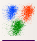
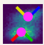

.. _user_machine_learning:

Tutorial: Machine Learning
==========================

One of the directions Cytoflow is going in that I'm most excited about is the 
application of advanced machine learning methods to flow cytometry analysis. 
After all, cytometry data is just a high-dimensional data set with many data 
points: making sense of it can take advantage of some of the sophisticated 
methods that have seen great success with other high-throughput biological 
data (such as microarrays.)

The following tutorial goes in depth on a common machine-learning method, 
Gaussian Mixture Models, then demonstrates with briefer examples some of the 
other machine learning methods that are implemented in Cytoflow.

Import the data
---------------

* Start Cytoflow.  Under the **Import Data** operation, choose **Set up experiment...**

* Add one variable, *Dox*.  Make it a *Number*.

* From the *examples-basic* data set, import *RFP_Well_A3.fcs* and
  *CFP_Well_A4.fcs*.  Assign them *Dox = 10.0* and *Dox = 1.0*, respectively.
  Your setup should look like this:
  
  .. image:: images/machine01.png

* Choose **OK**
  
* Optional: Remove the **-W** and **-H** channels from the **Import Data** 
  operation; we're only using the **-A** channels.  Your **Import Data** 
  operation should look like this:
  
  .. image:: images/machine02.png
  
* Click the **Import!** button in the **Import Data** operation.
  
Examine the data
----------------
* Create a **Histogram** view.  Set the channel to **Y2-A** and the scale 
  to **logicle**.

  .. image:: images/machine03.png
  
  This data looks pretty bi-modal to me.  If we wanted to separate out those 
  two populations, a **Threshold** operation would do nicely.  However, using 
  a Gaussian mixture model comes with some advantages which we will see.
  
Create a Gaussian mixture model
-------------------------------
  
* To model this data as a mixture of Gaussians, click the **1D Mixture Model** 
  button: |1D_GMM|

* Set the parameters as follows:
  
  * **Name** -- "Gauss" (or something memorable -- it's arbitrary)
  
  * **Channel** -- **Y2-A** (the channel we're applying the model to)
  
  * **Scale** -- **logicle**  (we want the *logicle* scale applied to the 
    data before we model it)
  
  * **Num Components** -- 2  (how many components are in the mixture?)
  
  ...and click **Estimate!**  You'll see a plot like this:
  
  .. image:: images/machine05.png
  
  Excellent. It looks like the mixture model found two populations and separated 
  them out.
  
* What did the **Gaussian Mixture Model** operation actually do?  Just like a 
  threshold gate, it makes two new populations -- in this case, they're named 
  **Gauss_1** and **Gauss_2**.  You can now view and manipulate them just like 
  you could if you defined the two populations with any other gate.  For example, 
  I can view them on separate histograms:
  
  .. image:: images/machine06.png
  
Advanced GMM uses
-----------------

* Sometimes, data does not separate "cleanly" like this data set does.  If that's 
  the case, you can set the **sigma** estimation parameter.  This tells the 
  operation to create a new boolean variable for each component in the model, 
  which is **True** if the event is within **sigma** standard deviations of 
  the population mean.  For example, if we set **sigma** to ``1`` and click 
  **Estimate!**, our diagnostic plot remains the same:
  
  .. image:: images/machine07.png
  
  ...but now we've got two additional variables, **Gauss_1** and **Gauss_2**.
  For example, I can make a histogram and set the color facet to **Gauss_1**:
  
  .. image:: images/machine08.png
  
  and we can see that only the "center" of the first population has the **Gauss_1**
  variable set to **True**.
  
* Sometimes, we don't want to use the same model parameters for the entire data
  set.  Instead, sometimes you want to estimate different models for differe
  subsets.  The **Gaussian Mixture Model** (and other data-driven operations)
  have a **Group Estimates By** parameter that allows you to just that.  For
  example, let's say I want a different model estimated for each value of **Dox**
  (remember, that's my experimental variable.)  I set **Group Estimates By**
  to **Dox**, and instead of getting one mixture model, now I get one for each
  different value of **Dox**:
  
  .. image:: images/machine09.png
  
  Note that there are two models shown, one for each value of **Dox**.  (Note that
  I set **Vertical Facet** on the view to **Dox** to show both of them.
  
* Finally, in addition to gating events, data-driven modules also often create 
  new statistics as well.  For example, the **Gaussian Mixture Model** operation
  creates two statistics, **mean** and **proportion**, recording the mean of 
  each population and the proportion of events that was in that population.  This
  is particularly powerful when combined with the **Group Estimates By** 
  parameter.  For example, in the image above, it's pretty clear that there weren't
  many events in the **Gauss_2** population for **Dox = 1.0**.  Let's look at
  the actual proportions using a bar graph:
  
  .. image:: images/machine10.png
  
  The :ref:`user_induction` tutorial gives a non-trival example of this.
  

More Machine Learning Operations
--------------------------------

* |2D_GMM| **2-dimensional Gaussian Mixture model**

  A gaussian mixture model that works in two dimensions (ie, on a scatterplot.)
  
  .. image:: images/machine11.png
  
* |DENSITY| **Density gate**

  Computes a gate based on a 2D density plot.  The user chooses what proportion
  of events to keep, and the module creates a gate that selects the events in
  the highest-density bins of a 2D histogram.
  
  .. image:: images/machine14.png
  
* |KMEANS| **K-means clustering**

  Uses k-means clustering on a scatter-plot.  This sometimes works better than 
  a 2D Gaussian mixture model if the populations aren't "normal" (ie, Gaussian-
  shaped).
  
  .. image:: images/machine16.png
  
* |FLOWPEAKS| **flowPeaks**

  Sometimes, Gaussian mixtures and k-means clustering don't do a great job of
  clustering flow data. These clustering methods like data that is "compact" --
  regularly spaced around a "center".  Many data sets are not like that.  For
  example, this one, from the ``ecoli.fcs`` file in ``examples-basic/data``:
  
  .. image:: images/machine17.png
  
  There are clearly two populations, but the Gaussian mixture method isn't
  effective at separating them:
  
  .. image:: images/machine18.png
  
  And neither is k-means:
  
  .. image:: images/machine19.png
  
  In cases like this, a flow cytometry-specific method called ``flowPeaks`` may
  work better.  
  
  .. image:: images/machine20.png
  
  ``flowPeaks`` is nice in that it can automatically discover the "natural"
  number of clusters.  There are two caveats, though.  First, the 
  peak-finding can be quite sensitive to the estimation parameters ``h``, ``h0``, 
  ``t`` and ``Merge distance``.  The defaults are a good place to start, but if you're 
  having trouble getting good performance, try tweaking them (see the documentation
  for what they mean.)  And second, ``flowPeaks`` is quite computationally 
  expensive.  Thus, on large data sets, it can be quite slow.

