.. _user_microbial_diversity:

Tutorial: Microbial Diversity
=============================

Flow cytometry can characterize a complex mixture of cells based on their 
morphology and staining -- and those mixtures are not just mammalian cells! 
Microbial ecology studies are increasingly turning to flow cytometry, and 
Cytoflow has a bunch of tools that can support these studies too.

This tutorial demonstrates one approach using data from *Görnt A et al,*
*Chemical and microbial similarities and heterogeneities of wastewater from*
*single-household cesspits for decentralised water reuse. Water Reuse 15(2),*
*255-270. 2025.* `DOI: 10.2166/wrd.2025.011 <https://doi.org/10.2166/wrd.2025.011>`_. The authors collected 
wastewater from cesspits, staines samples with Hoescht dye and propidium iodide, 
then ran them through a flow cytometer. To compute a Shannon diversity index, 
they clustered events using a self-organizing map, then treated each cluster as 
a "species".

If you'd like to follow along, you can do so by downloading one of the
**cytoflow-#####-examples-basic.zip** files from the 
`Cytoflow releases page <https://github.com/cytoflow/cytoflow/releases>`_
on GitHub. These data are in the `data/microbial_diversity` subfolder.

Preprocessing
-------------

The raw data, downloaded from https://zenodo.org/records/14731601, contained 
approximately 600,000 events across 59 channels -- this is what happens when 
you collect your data on a sorter, I suppose. I subsampled this data to 
30,000 events per sample and only included the FSC, SSC, PI (propidium iodide) 
and Hoescht (Hoescht 33342) channels. Additionally, while the study included 
20 sites, I have only included data for 5. No other data cleaning or 
transformation was applied.

Import the data
---------------

Open the experiment setup panel and select all of the files. (Remember, you can
click the first, then shift-click the last, to select multiple files.)
Because we don't have any metadata besides the filename, change the **CF_File** 
column type to **Category** and click **OK**.

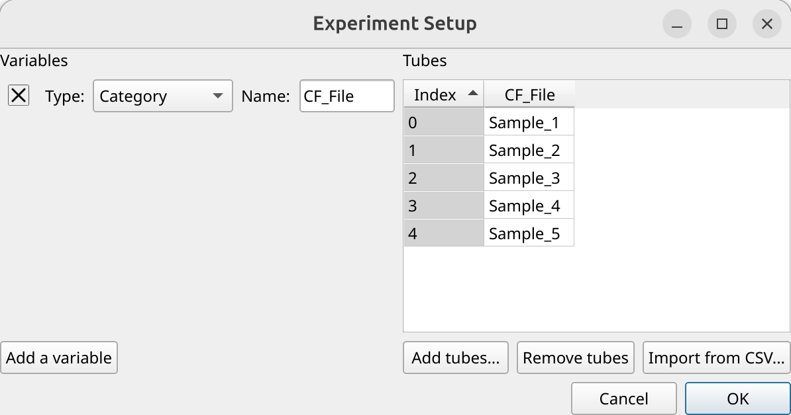

Preview and gate the data
-------------------------

Let's have a quick look at the FSC/SSC distribution (both on a log scale)

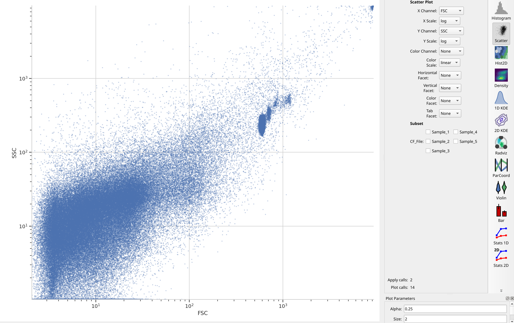

Note a number of "strange" clusters, one at about 10^3 in the ``FSC`` channel 
and the other at the very top-right. The investigators included both 10 um 
counting beads and 1 um Bright Blue beads; I think the counting beads are the 
clusters at 10^3 and the 10 uM beads are up at 10^4. Both also show up in the 
``Hoescht`` channel:

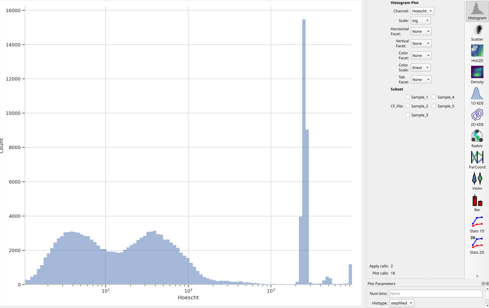

The investigators are using Hoescht 33342 dye to distinguish real cells from 
junk with a threshold of 10 in the Hoescht channel. We'll do the same -- that 
seems to split the low population from the high. But instead of a **Threshold**
operation, let's use a **Range** operation so we can also get rid of the beads, 
which are all brighter than 10^3.

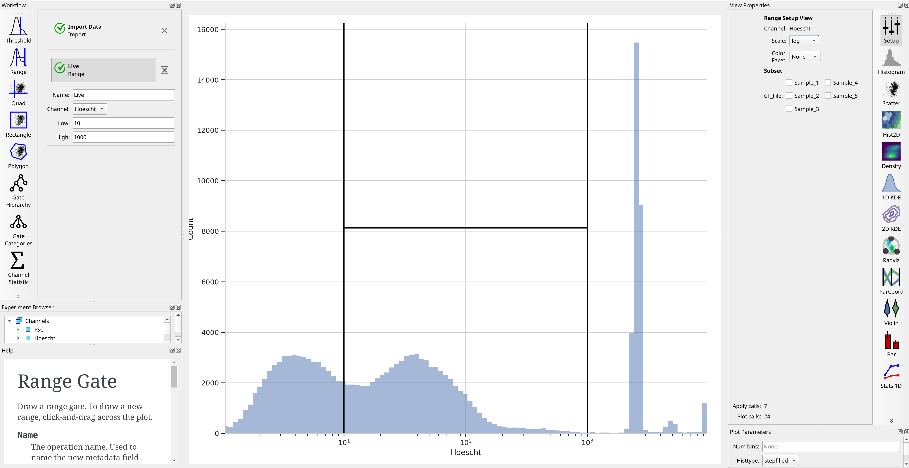

Let's check: if we plot an ``FSC`` / ``SSC`` scatter plot with the ``Live+`` 
subset selected, did we get rid of those clusters?

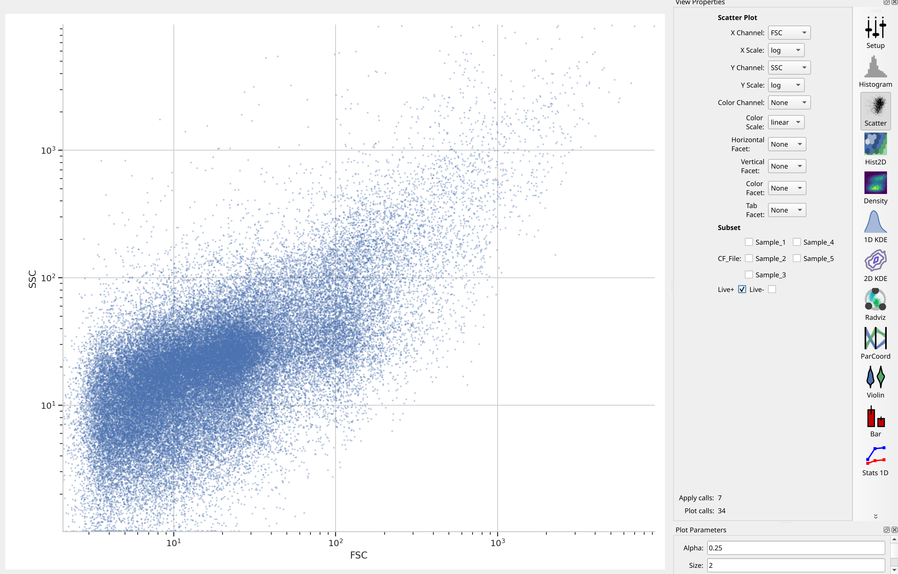

We sure did -- and without gating out the other events with high ``FSC`` and 
``SSC``! Nice.

Cluster with a self-organizing map
----------------------------------

The researchers used a self-organizing map with 2025 clusters -- that 
corresponds to a 45x45 map. They did **not** cluster on ``Hoescht``, but instead 
used only ``FSC``, ``SSC`` and ``PI``. (Note that we're disabling consensus 
clustering -- we want to keep all 2025 clusters. And don't forget to estimate 
the map using the ``Live+`` subset!)

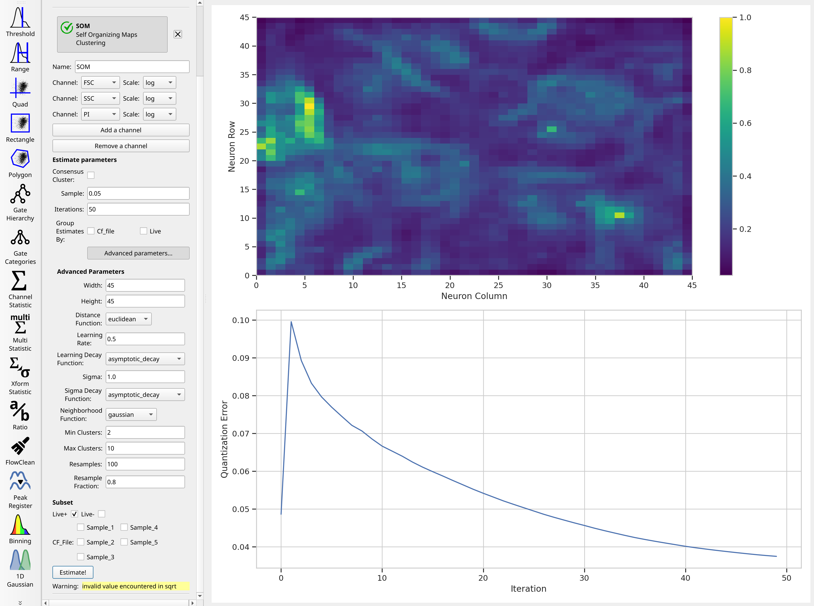

Huh. It's not clear that after the default 50 iterations, that the model has 
converged -- if you'd like, feel free to run the training for more iterations. 
There is a lot of structure in the neuron map, though. And remember, the map was 
trained using a subset of the data -- by default, 5%. You can increase that
if you'd like.

Count events in each cluster
----------------------------
Remember, when we want to summarize some flow data, we create a **statistic.** 
There are a number of operations that do so, but since we're only interested in 
one channel, we'll use the *Channel Statistic* operation. And actually, since 
all we're doing is counting events, it doesn't matter which channel we compute
on! So let's count the number of events in each cluster in each sample (that is
also *Live+*, remember!)

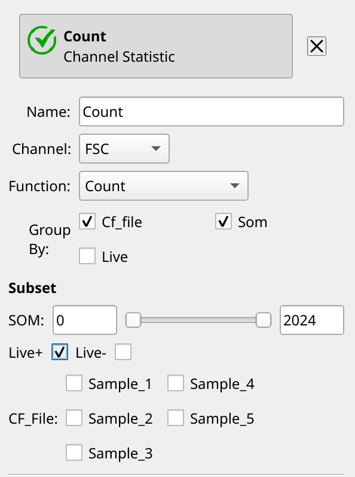

Now, let's make a table. *Cytoflow* uses a plotting package called *matplotlib*,
and while it makes lovely plots, creating large tables with it is infeasible.
Note the error you get when you try to create a table with ``CF_File`` as the
row and ``SOM`` (the self-organizing map cluster) as the column:

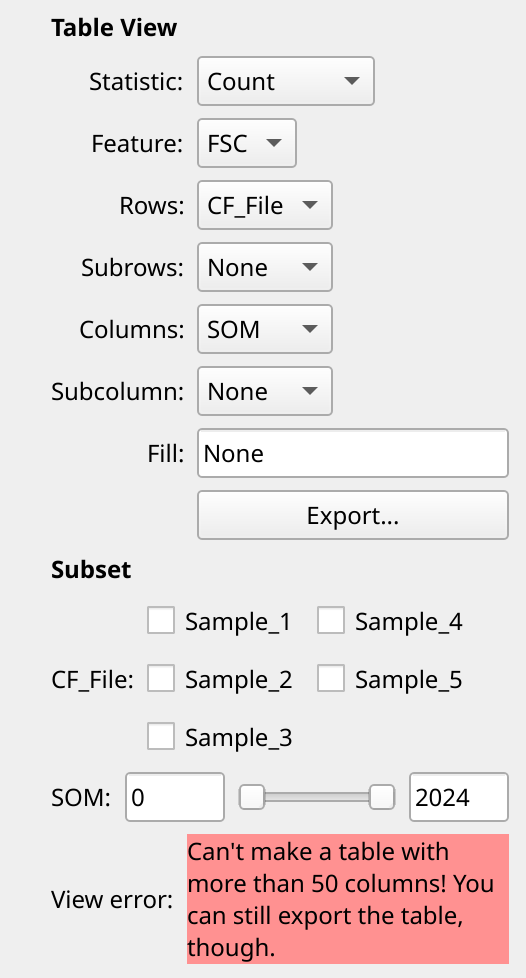

However, you can still export the table to a CSV file and use a spreadsheet
program to open it! Click the ``Export...`` button and give it a file name,
but heed the warning:

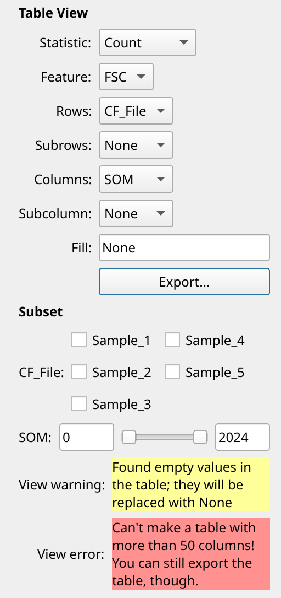

*Cytoflow* is telling you that you have **missing data** in your table. 
This could happen, for example, if there were clusters that didn't have any
events from a particular sample. 

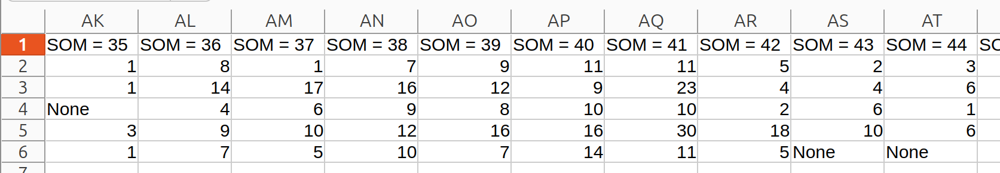

*Cytoflow* doesn't automatically assume that you want to replace that with any 
particular value, but in this case it makes sense to fill those cells with *0*. 
You can do that by changing the *Fill* attribute:

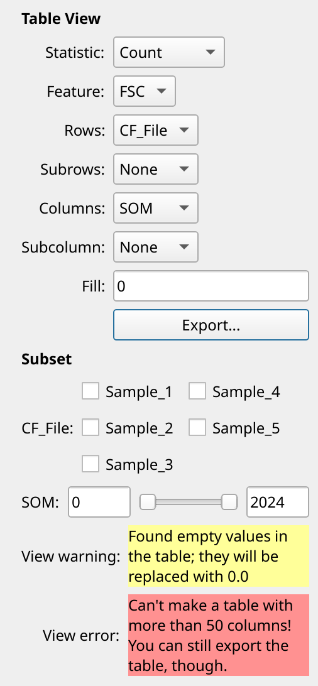

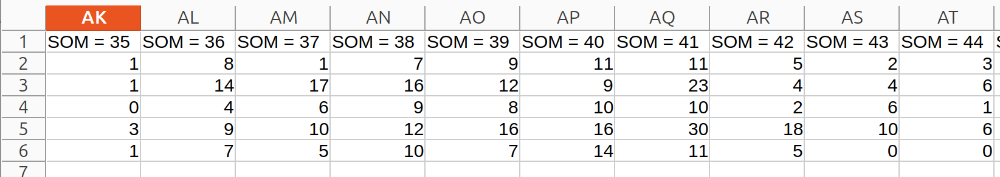

Now, you can go use another tool to compute Shannon alpha diversity. Do note that
in the Jupyter Lab version of this tutorial, we loaded another package from
the Scientific Python universe and computed those values directly. Go learn
Python!

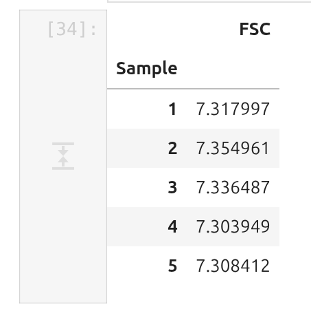

These values are quite close to the values reported by the researchers, which 
were all 7.4 or so.

