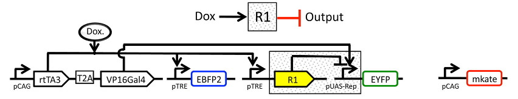

.. _user_repressor:

Tutorial: Transcriptional Repressor Characterization
====================================================

This example demonstrates using ``cytoflow`` to use calibrated flow cytometry to
characterize a transcriptional repressor in a mammalian multi-plasmid system.
The implementation closely follows that described in 
`Beal et al <http://dspace.mit.edu/handle/1721.1/69973>`_ and its implementation in
`Davidsohn et al <http://pubs.acs.org/doi/abs/10.1021/sb500263b>`_. 
The experiment whose data we'll be analyzing characterizes a TALE transcriptional 
repressor (TAL14, from 
`Li et al <http://www.nature.com/nchembio/journal/v11/n3/full/nchembio.1736.html>`_)
using a multi-plasmid transient transfection in mammalian cells, depicted below:

The small molecule doxycycline ("Dox") drives the transcriptional activator rtTA3 
to activate the transcriptional repressor ("R1" in the diagram), which then 
represses output of the yellow fluorescent protein EYFP. rtTA3 also drives 
expression of a blue fluorescent protein, eBFP, which serves as a proxy for the 
amount of repressor. Finally, since we're doing transient transfection, there's 
a huge amount of variability in the level of transfection; we measure transfection 
level with a constitutively expressed red fluorescent protein, mKate.

If you'd like to follow along, you can do so by downloading one of the
**cytoflow-#####-examples-advanced.zip** files from the 
`Cytoflow releases page <https://github.com/cytoflow/cytoflow/releases>`_
on GitHub.  The files are in the **tasbe/** subdirectory.

Setup
-----

* Start Cytoflow. Under the **Import Data** operation, choose **Set up experiment...**

* Add one variable, **Dox** -- make it a **Number**.

* Load the ``TAL14....fcs`` files from the ``tasbe/`` subdirectory, and fill in the
  ``Dox`` concentrations as per the table below:
  
  .. image:: images/repressor02.png
  
Gate out the debris
-------------------

* Use a scatter plot to look at the ``FSC_A`` and ``SSC_A`` channels:

  .. image:: images/repressor03.png
  
* This looks pretty good -- a nice tight distribution.  Let's use a 2D gaussian
  model to take 2 standard deviations around the centroid.
  
  .. image:: images/repressor04.png
  
TASBE Calibration
-----------------

* Use the TASBE calibration module to calibrate the ``FITC_A``, ``Pacific_Blue_A``,
  and ``PE_Tx_Red_YG_A`` channels.  Settings:
  
  * Autofluorescence / Blank file: ``controls/Blank-1_H12_H12_P3.fcs``
  * Bleedthrough / PE_Tx_Red_YG_A file: ``controls/mkate-1_H8_H08_P3.fcs``
  * Bleedthrough / FITC_A file: ``controls/EYFP-1_H10_H10_P3.fcs``
  * Bleedthrough / Pacific_Blue_A file: ``controls/EBFP2-1_H9_H09_P3.fcs``
  
  * Beads: ``Spherotech RCP-30-5A Lot AA01-AA04, AB01, AB02, AC01, GAA01-R``
  * Beads file: ``controls/BEADS-1_H7_H07_P3.fcs``
  * Beads unit: ``MEFL``
  * Remaining beads parameters: left at default
  
  * Color translation / Do color translation? : ``True``
  * Color translation / To channel: ``FITC_A``
  * Color translation / Use mixture model? ``True``
  
  * Color translation / PE_Tx_Red_YG_A -> FITC_A: ``controls/RBY-1_H11_H11_P3.fcs``
  * Color translation / Pacific_Blue_A -> FITC_A: ``controls/RBY-1_H11_H11_P3.fcs``
  
  * Subset / Morpho_1+: ``True``
  
  .. image:: images/repressor05.png
  
  .. image:: images/repressor06.png
  
  .. image:: images/repressor07.png
  
  .. image:: images/repressor08.png
  
  .. image:: images/repressor09.png
  
  
Binned Analysis
---------------

As described above, the example data in this notebook is from a transient 
transfection of mammalian cells in tissue culture. What this means is that there's 
a really broad distribution of fluorescence, corresponding to a broad distribution 
of transfection levels.
  
* Let's check the ``PE_Tx_Red_YG_A`` channel, where our mKate transfection marker is:

  .. image:: images/repressor10.png
  
The way we handle this data is by dividing the cells into bins depending on 
their transfection levels. We find that cells that recieved few plasmids 
frequently behave differently (quantitatively speaking) than cells that received
many plasmids. The **Binning** module applies evenly spaced bins; in this example, 
we're going to apply them on a log scale, every 0.1 log-units.
  
* Apply the **Binning** module with a log scale and a bin width of 0.1 log units:

  .. image:: images/repressor11.png
  
* Also, we really only want to look at transfected cells -- so let's use a 
  **1D Gaussian** gate to separate the transfected population from the 
  untransfected population:
  
  .. image:: images/repressor12.png
  
Creating Transfer Curves
------------------------

* Let's normalize our input and output fluorescent proteins by our constitutive protein
  expression using **Ratio** operation:
  
  .. image:: images/repressor13.png
  
  .. image:: images/repressor14.png
  
* Now, create four statistics: the geometric mean of the input and output fluorescence measurements
  ,both normalized and not, for each bin, in each ``Dox`` condition.  And make sure
  to only look at transfected single cells!
  
  .. image:: images/repressor15.png
  
  .. image:: images/repressor16.png
  
  .. image:: images/repressor17.png
  
  .. image:: images/repressor18.png
  
* Now, we can start looking at transfer curves.  First question: does the blue signal 
  (our "input" signal) increase as we increase ``Dox`` concentration?
  
  .. image:: images/repressor19.png
  
  .. image:: images/repressor20.png
  
  Yes!  That's a good sign that our experiment is working.
  
* Does the yellow signal (our "output") decrease as the blue signal (our "input")
  increases?  Ie, is the repressor "inverting" the signal?
  
  .. image:: images/repressor21.png
  
  .. image:: images/repressor22.png
  
  The data is a little "messy" -- primarily because of bins that didn't have many
  events in them, and thus gave quite noisy signals -- but it's clear that we are
  seeing an inversion of the input signal to the output signal. The repressor works.
    
  
  
  